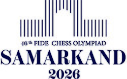
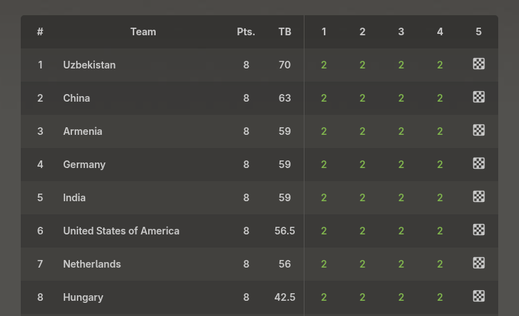
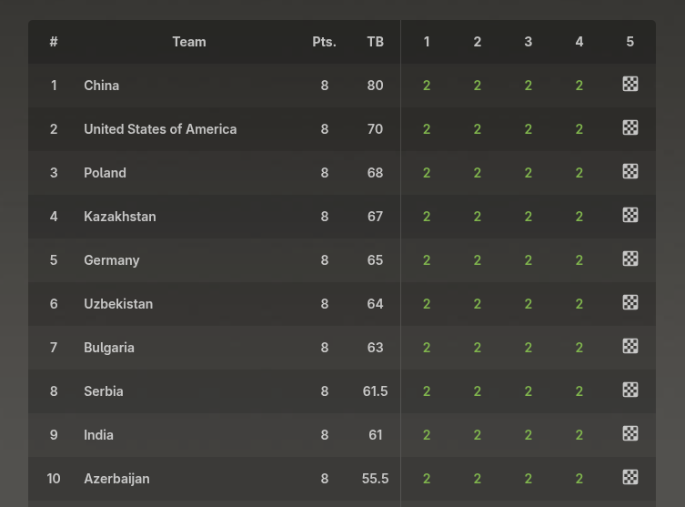

+++
date = '2026-09-20T15:39:41+02:00'
title = '46e Schaak Olympiade: Ronde 4'
weight = 9223372036642704626
+++

<!--
.image logo.jpg
-->

Overgenomen uit de [FIDE pagina](https://chessolympiad2026.fide.com/):

"""
**Every two years, national teams from across the world gather under their flags at the FIDE Chess Olympiad, representing the highest level of team competition in the game. Established champions and emerging talents meet across the board, carrying both global reputations and national pride.**

In September 2026, Samarkand stands at the centre of the chess world as the 46th FIDE Chess Olympiad brings together the game’s leading nations for its most prestigious team championship.

The Open and Women’s tournaments take place side by side, uniting hundreds of federations in eleven rounds of team competition. Representing their countries across four boards, teams contest the Olympiad titles as well as individual board honours in one of chess's most demanding formats.

Staged in a city shaped by centuries of cultural exchange, the Olympiad in Samarkand highlights Uzbekistan’s growing presence in world chess and its investment in the game’s future.
"""

Volgens [Wikipedia](https://en.wikipedia.org/wiki/46th_Chess_Olympiad) spelen er 191 ploegen in de Vrouwen-reeks en 202 ploegen in de Open-reeks.

Ook België speelt met 2 ploegen.

Na 4 ronden hebben we de volgende resultaten:

**Open tornooi**

<!--
.image open.png
-->

**Vrouwen**

<!--
.image woman.png
-->

