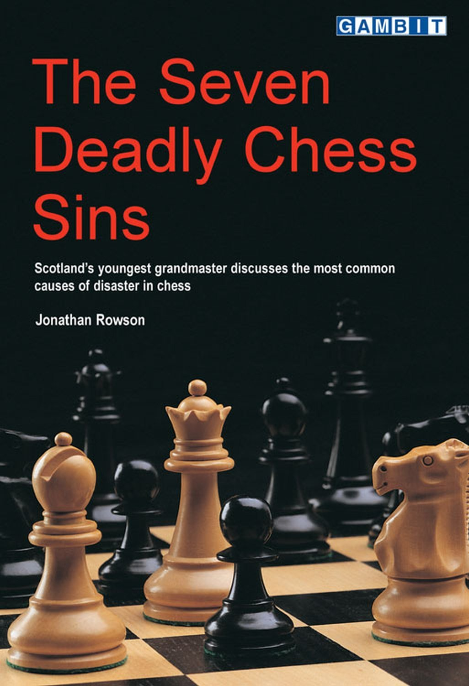
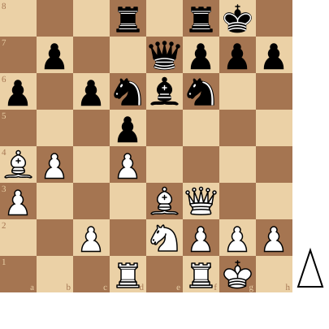

+++
date = '2026-08-24T18:59:16+02:00'
title = 'De 7 doodzonden van het schaken'
+++

<!--
.image sin.jpg
-->

In "The Seven Deadly Sins" raadt [Jonathan Rowson](https://nl.wikipedia.org/wiki/Jonathan_Rowson) aan om tegen je stukken te praten. Misschien een advies dat wat raar overkomt maar ik moet toegeven dat het wel werkt: het verlegt je focus naar dingen die je anders niet zou beschouwen.

In een vorige ontmoeting speelde ik tegen Michel. Michel speelde met wit een uiterst solide en foutloze partij en we kwamen terecht in een stelling die volgens [Stockfish](https://nl.wikipedia.org/wiki/Stockfish) nagenoeg gelijk stond.

<!--
.diagram game.pgn
-->

Ik begon tegen mijn koning te praten en vroeg hem van wat hij het meeste schrik had. Hij antwoordde: het manoeuvre met de dame naar g3 en dan de loper naar h6 ziet er echt wel dreigend uit.

Ik had echter een goed antwoord op dit manoeuvre: het paard kon naar f5 en van daar uit verdedigde hij het veld g7 en viel tegelijkertijd de loper op h6 en de dame op g3 aan.

Ik besloot de loperzet naar h6 nog wat aantrekkelijker te maken

<!--
.game game.pgn
-->

<!-- Game begin -->
<link href="/okra/js/lichess/pgn/lichess-pgn-viewer.css" type="text/css" rel="stylesheet" />

&#160;

<!-- Game end -->

... en de witte stelling stuikte in elkaar!

Praat tegen je stukken!

