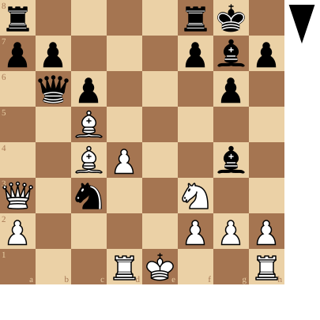

+++
date = '2026-09-04T17:07:35+02:00'
title = 'De beginjaren van Bobby Fischer'
weight = 9223372036644081752
+++

Het minste dat je van AI kan zeggen, is dat het een fantastisch educatief instrument is.

Deze tekst - geproduceerd door AI op basis van bestaand film en foto materiaal - vertelt het fascinerend verhaal van de jonge Bobby Fischer

<!--
.yt m_q4YB7xrrk
-->


Je kan de video ook bekijken op [dropbox](https://www.dropbox.com/scl/fi/969lvr9qr029uft7jo6af/The_True_Beginning_Of_Bobby_Fischer_m_q4YB7xrrk.mp4?rlkey=16mnyt4j6dzr9ugz0bp9a02cv&dl=0)
Ook de partij van eeuw wordt getoond!

<!--
.diagram r4rk1/pp3pbp/1qp3p1/2B5/2BP2b1/Q1n2N2/P4PPP/3RK2R b K - 1 16
-->

(Partij geannoteerd door chess.com)

<!--
.game game.pgn
-->

<!-- Game begin -->
<link href="/okra/js/lichess/pgn/lichess-pgn-viewer.css" type="text/css" rel="stylesheet" />

&#160;

<!-- Game end -->

