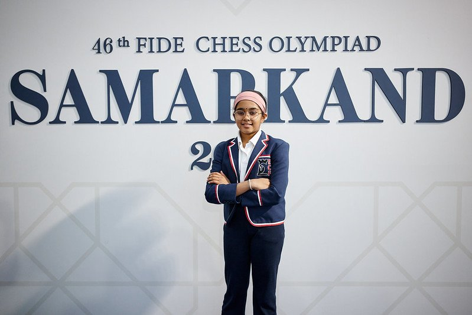

+++
date = '2026-09-29T16:19:58+02:00'
title = 'Bodhana Sivanandan WGM/IM'
weight = 9223372036641924609
+++

<!--
.image image.jpg
-->

Herinner je nog het artikel 
<!--
.link puzzles/Sivanandan/index.md
-->
[Bodhana Sivanandan]() (puzzel)

Wel, [Bodhana Sivanandan](https://nl.wikipedia.org/wiki/Bodhana_Sivanandan) speelde ook in de Olympiade van 2026 en haalde er op 11-jarige leeftijd zowel de WGM (Woman Grandmaster) [titel](https://en.wikipedia.org/wiki/FIDE_titles) als de IM (International Master) [titel](https://en.wikipedia.org/wiki/FIDE_titles).

