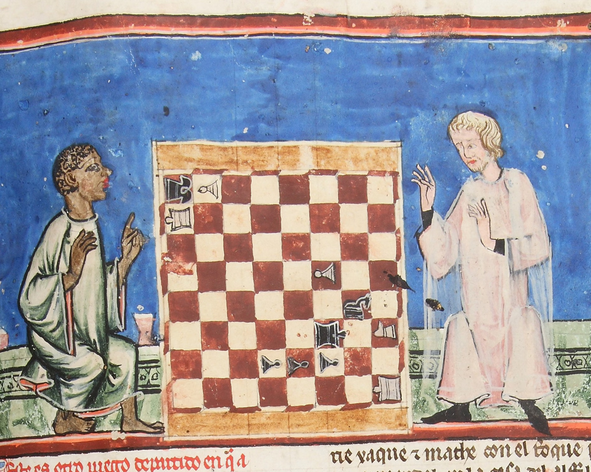
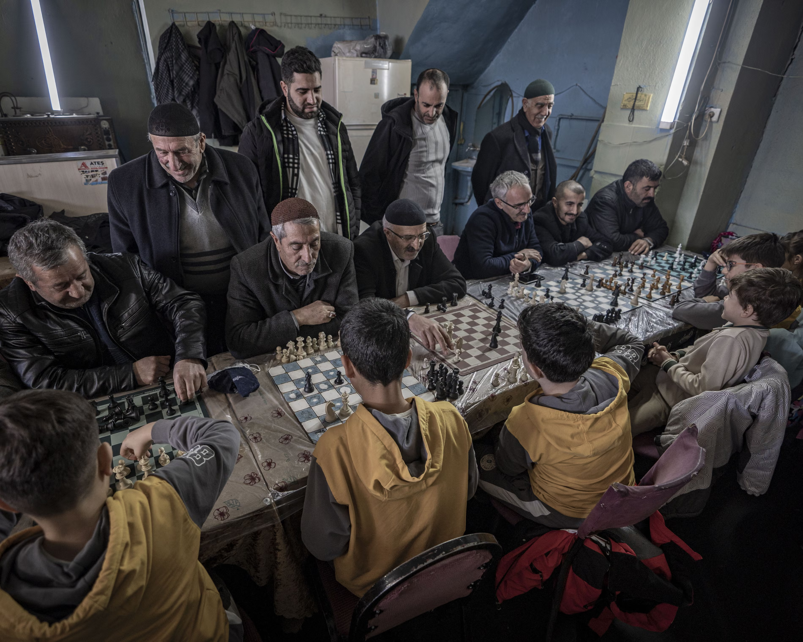

+++
date = '2026-03-19T14:32:26+01:00'
title = 'Brug tussen mensen'
+++

Eén van de fijnste elementen van schaken is dat het spel een brug legt tussen mensen. 
Ongeacht hoe je tegenstander er uit ziet, waar hij woont, hoe hij door het leven gaat, eens je aan het schaakbord zit
en je de strijd aangaat dan verdwijnt alles behalve kennis, inzicht, sluwheid, creativiteit en weerbaarheid.

De [Guardian](https://www.theguardian.com) is een absolute top-krant, het is één van de weinige progressieve kranten en het schaadt echt niet dat de krant ook nog eens gratis leesbaar is (hoewel een abonnement wel aan te raden is).

De volgende afbeeldingen zijn terug te vinden in de Guardian.

Deze afbeelding uit 1283(!) toont een match tussen een blanke priester uit Sevilla die op het punt staat te verliezen van een zwarte schaker.

 

 Deze afbeelding toont schaken als een brug tussen oud en jong. Het is een foto genomen door een toerist op reis doorheen Turkije.

  

