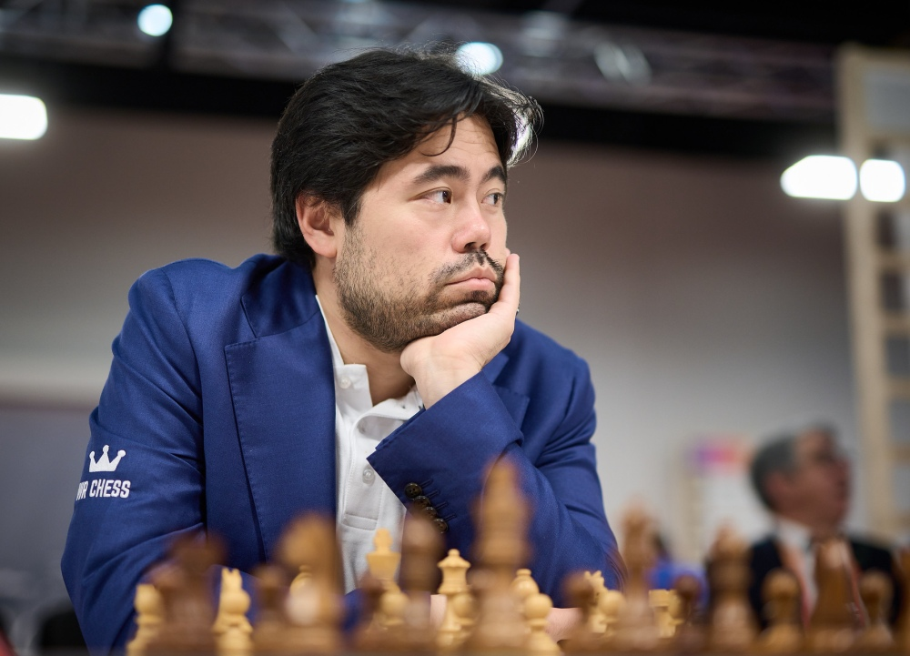
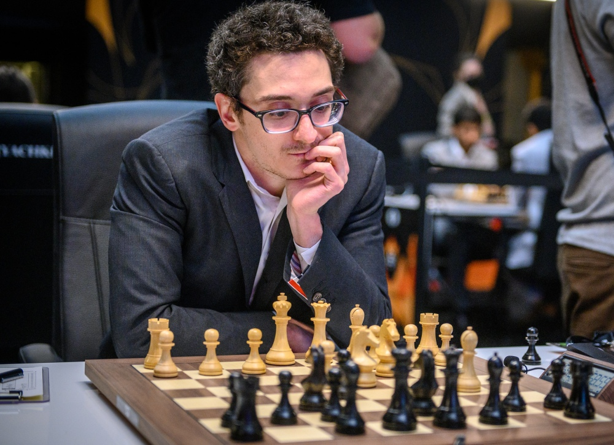
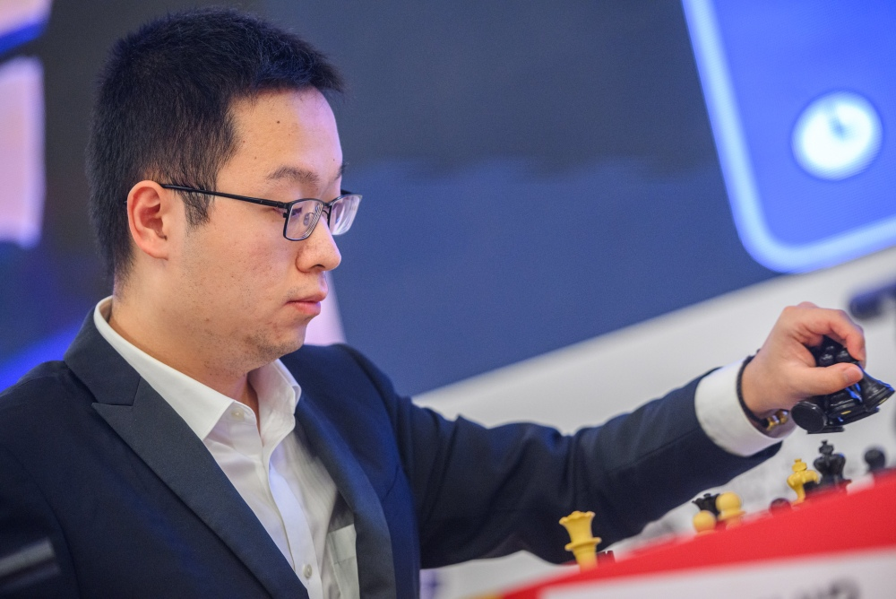
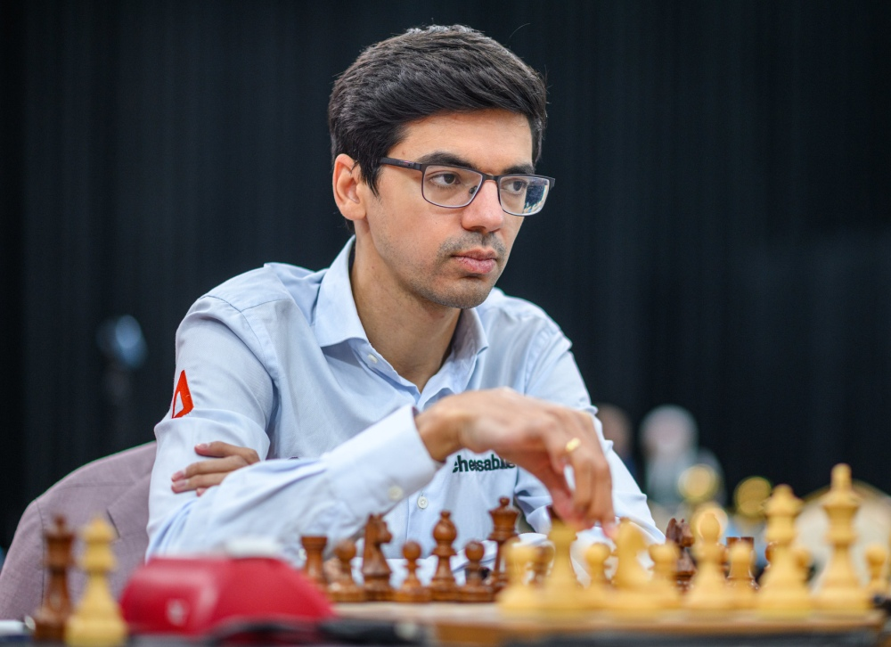
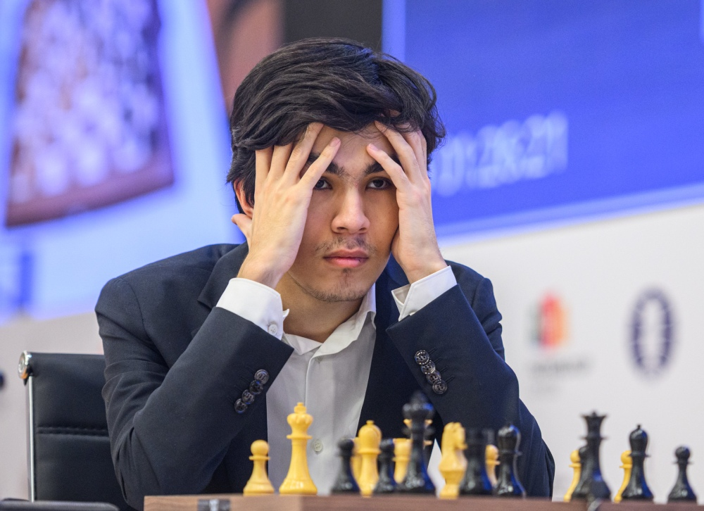
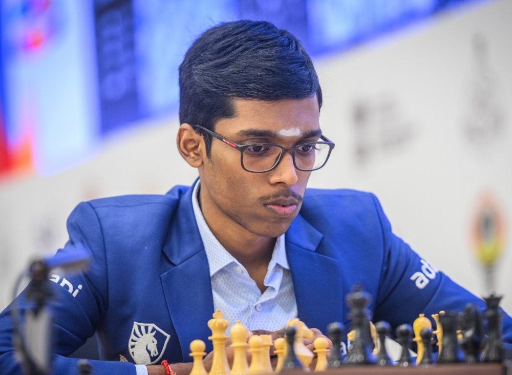
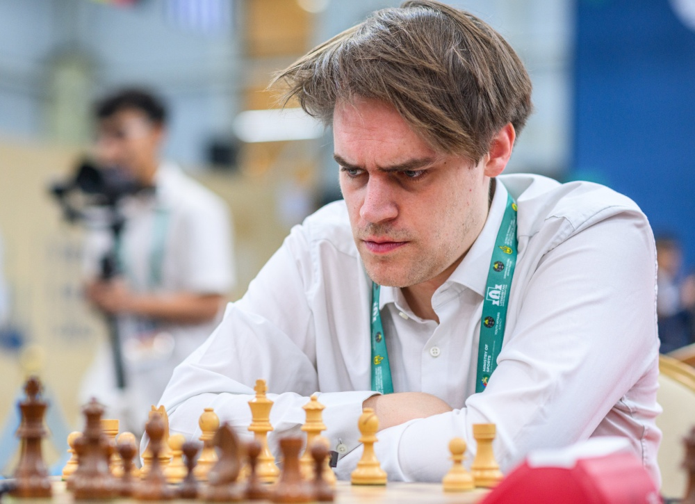
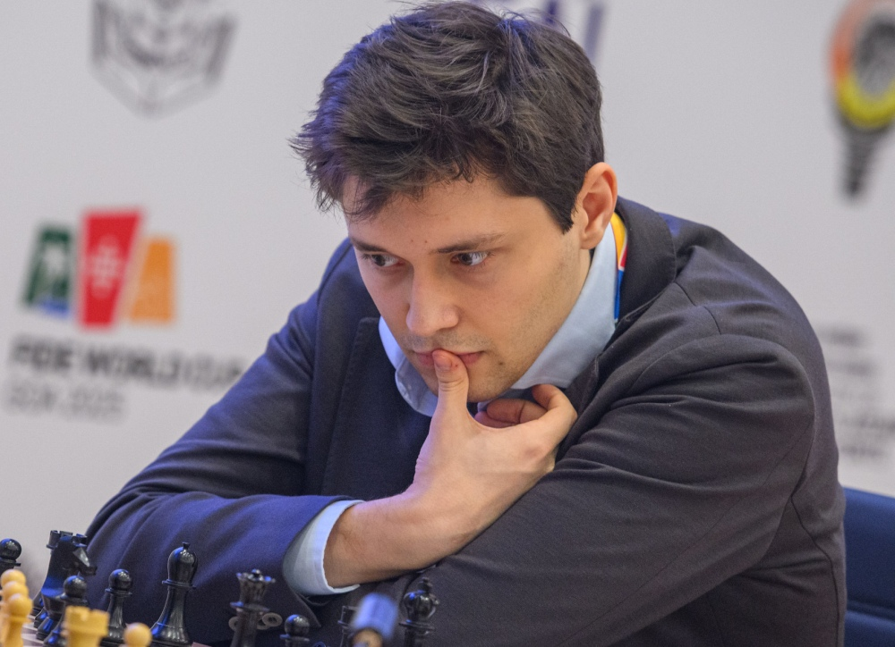

+++
date = '2026-03-18T09:50:00+01:00'
title = 'Kandidaten tornooi'
+++

Elke 2 jaar start een nieuwe cyclus voor het werelkampioenschap.
Het kandidaten tornooi 2026 gaat uitmaken wie het opneemt tegen huidig wereldkampioen Gukesh.

Het [tornooi](https://en.wikipedia.org/wiki/Candidates_Tournament_2026) vindt plaats op Cyprus van 28 maart tot 16 april.

Er zijn 8 kandidaten (in volgorde van ELO)

- Hikaru Nakamura (USA, 2810)

  

- Fabiano Caruana (USA, 2795)

  

- Wei Yi (China, 2754)

  

- Anish Giri (Netherlands, 2753)

  

- Javokhir Sindarov (Uzbekistan, 2745)

  

- Praggnanandhaa R (India, 2741)

  

- Matthias Bluebaum (Germany, 2698)

  

- Andrey Esipenko (FIDE, 2698)

  

