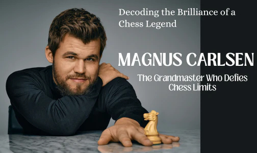

+++
date = 2026-05-17T14:24:49+02:00
title = "Waarom speelt Carlsen zo sterk? (deel 1)"
weight = 9223372036653595518
+++

Een fascinerend onderzoek door een schaakmeester/psycholoog/researcher naar de werking van het brein van een schaker: deel 1

<!--
.tube https://www.youtube.com/watch?v=2pd6xtEAaJE&list=PLlN1WdzKJmlLS17Yu35d7HPJqvpL9VKwM&index=6
-->


<!--
.dropbox https://www.dropbox.com/scl/fi/shl22b6vqsdyi1v7th7su/What_makes_Magnus_Carlsen_unbeatable_The_psychology_behind_chess_with_Fernand_Gobet_Part_1-2pd6xtEAaJE.mp4?rlkey=87dhprq1cxgu3mzev2ohgyj9f&st=dr8l7jf2&dl=0
-->
Je kan de video ook bekijken op [dropbox](https://www.dropbox.com/scl/fi/shl22b6vqsdyi1v7th7su/What_makes_Magnus_Carlsen_unbeatable_The_psychology_behind_chess_with_Fernand_Gobet_Part_1-2pd6xtEAaJE.mp4?rlkey=87dhprq1cxgu3mzev2ohgyj9f&st=dr8l7jf2&dl=0)
