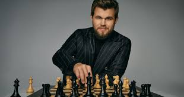

+++
date = '2026-05-17T14:24:49+02:00'
title = 'Waarom speelt Carlsen zo sterk? (deel 2)'
+++

<!--
.image image2.jpg
-->

Een fascinerend onderzoek door een schaakmeester/psycholoog/researcher naar de werking van het brein van een schaker: deel 2

<!--
.tube https://www.youtube.com/watch?v=pYx3jGpXHds&list=PLlN1WdzKJmlLS17Yu35d7HPJqvpL9VKwM&index=5
-->


<!--
.dropbox https://www.dropbox.com/scl/fi/1owszqrigrebu5el2r5g2/What_makes_Magnus_Carlsen_so_good_The_psychology_behind_chess_with_Fernand_Gobet_Part_2-pYx3jGpXHds.mp4?rlkey=utdizk0zyrfce52he4gpx23d9&st=mvgp20og&dl=0
-->
Je kan de video ook bekijken op [dropbox](https://www.dropbox.com/scl/fi/1owszqrigrebu5el2r5g2/What_makes_Magnus_Carlsen_so_good_The_psychology_behind_chess_with_Fernand_Gobet_Part_2-pYx3jGpXHds.mp4?rlkey=utdizk0zyrfce52he4gpx23d9&st=mvgp20og&dl=0)

