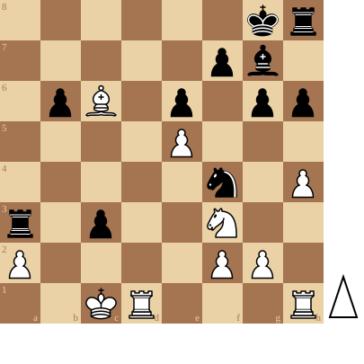

+++
date = '2026-05-18T12:44:13+02:00'
title = 'En passant en Magnus Carlsen'
+++

En passant is zo een schaakregel die niet zo goed wordt begrepen door beginnende schakers.

In de volgende video legt Daniel Rensch (Internationaal schaakmeester en mede-eigenaar van chess.com) uit hoe een en ander in mekaar zit:

<!--
.tube https://www.youtube.com/watch?v=M-f95OHjkLA&list=PLlN1WdzKJmlLS17Yu35d7HPJqvpL9VKwM&index=1
-->


<!--
.dropbox https://www.dropbox.com/scl/fi/0a2lnhkxbugho63a8dib4/En_Passant_Explained_M_f95OHjkLA.mp4?rlkey=64fs7ra42cizyz4lxx3gmqjbw&st=e84h3h24&dl=0
-->
Je kan de video ook bekijken op [dropbox](https://www.dropbox.com/scl/fi/0a2lnhkxbugho63a8dib4/En_Passant_Explained_M_f95OHjkLA.mp4?rlkey=64fs7ra42cizyz4lxx3gmqjbw&st=e84h3h24&dl=0)

Kijk eens wat Magnus Carlsen overkwam tijdens een blitz wedstrijd:

<!--
.diagram game.pgn
-->

<!--
.tube https://www.youtube.com/watch?v=Q_iGTCuiSqw&list=PLlN1WdzKJmlLS17Yu35d7HPJqvpL9VKwM&index=16
-->


<!--
.dropbox https://www.dropbox.com/scl/fi/wh8meik1z15bhzf6uiaud/Magnus_gets_crushed_by_En_Passant_Checkmate_ches.mp4?rlkey=t5gt3lu4ilmfhj9fsa4t6v6sr&st=92zalq0s&dl=0
-->
Je kan de video ook bekijken op [dropbox](https://www.dropbox.com/scl/fi/wh8meik1z15bhzf6uiaud/Magnus_gets_crushed_by_En_Passant_Checkmate_ches.mp4?rlkey=t5gt3lu4ilmfhj9fsa4t6v6sr&st=92zalq0s&dl=0)

<!--
.game game.pgn
-->

&#160;

