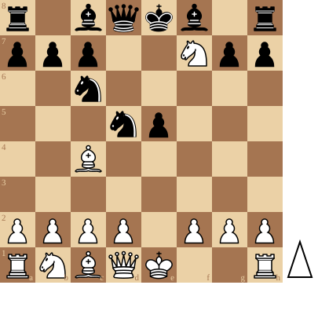
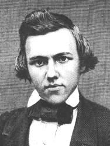
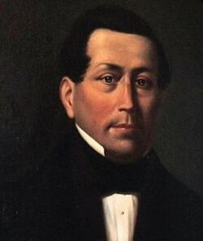
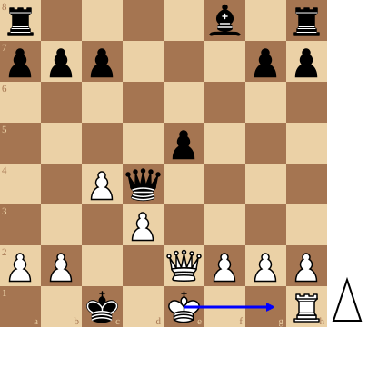

+++
date = 2026-06-12T06:46:02+02:00
title = "De fried liver attack en schaakmat door rokade"
weight = 9223372036651376645
+++

<!--
.diagram r1bqkb1r/ppp2Npp/2n5/3np3/2B5/8/PPPP1PPP/RNBQK2R w KQkq - 0 1
-->

De [Fried Liver Attack](https://en.wikipedia.org/wiki/Fried_Liver_Attack) is een van de meest beruchte openingen in het schaakspel: nagenoeg alle beginnende schakers ondergaan het paard offer op de zesde zet.

Niemand minder dan Magnus Carlsen is hier een liefhebber van met ... zwart. Alleen, hij weet daar altijd een extraatje aan mee te geven.
In de volgende partij zien we Carlsen een lesje geven aan [Gukesh](https://nl.wikipedia.org/wiki/Dommaraju_Gukesh)

<!--
.tube https://www.youtube.com/watch?v=ezza5yydBNw&t=59s
-->


<!--
.dropbox https://www.youtube.com/watch?v=ezza5yydBNw&t=59s
-->
Je kan de video ook bekijken op [dropbox](https://www.youtube.com/watch?v=ezza5yydBNw&t=59s)

We gaan echter een partij volgen van een ander wonderkind. In die partij zien we de dertien-jarige [Paul Morphy](https://nl.wikipedia.org/wiki/Paul_Morphy) aande slag tegen zijn vader [Alonzo](https://en.wikipedia.org/wiki/Alonzo_Morphy).

<!--
.image morphy.jpg
-->

<!--
.image amorphy.jpg
-->

De voorlaatste stelling is echter wel heel speciaal:

<!--
.diagram r4b1r/ppp3pp/8/4p3/2Pq4/3P4/PP2QPPP/2k1K2R w K - 0 1; arrow:e1g1
-->

Laten we de partij zelf volgen (de bespreking is door chess.com)

<!--
.game game.pgn
-->

&#160;

