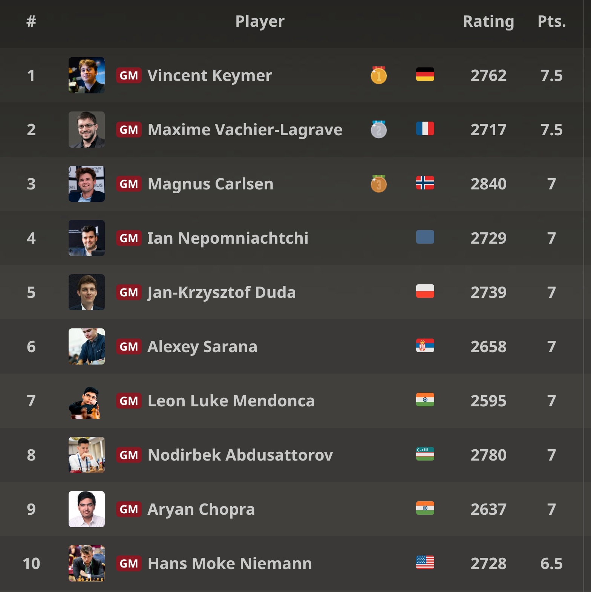

+++
date = '2026-04-07T15:51:25+02:00'
title = 'Grenke'
+++

Schaken is een spel voor nerds ...

Maar weet je, we zijn niet alleen!

De volgende beelden zijn van het [Grenke Chess Festival](https://en.wikipedia.org/wiki/Grenke_Chess_FestivalGrenke).

Dit tornooi gaat jaarlijks door in Karlsruhe (Duitsland).

In 2026 was er ook een Freestyle tornooi aan gekoppeld met een aantal supersterren.

Sfeerbeelden:


Je kan de video ook bekijken op [dropbox](https://www.dropbox.com/scl/fi/hns255172r0iff78803qk/BEHIND-THE-SCENES-grenke-Freestyle-Chess-Open-2026.mp4?rlkey=1i13a4467jl119t3smlx0zxhj&st=ccw9lkr9&dl=0)


Je kan de video ook bekijken op [dropbox](https://www.dropbox.com/scl/fi/ifrm9nfc8yryxk6t9xkqq/Drone-Flight-over-1500-Chessboards.mp4?rlkey=10lz9uom453ho4u3vrt5zt2g1&st=g36utyc7&dl=0)

Het resultaat van het freestyle tornooi:

