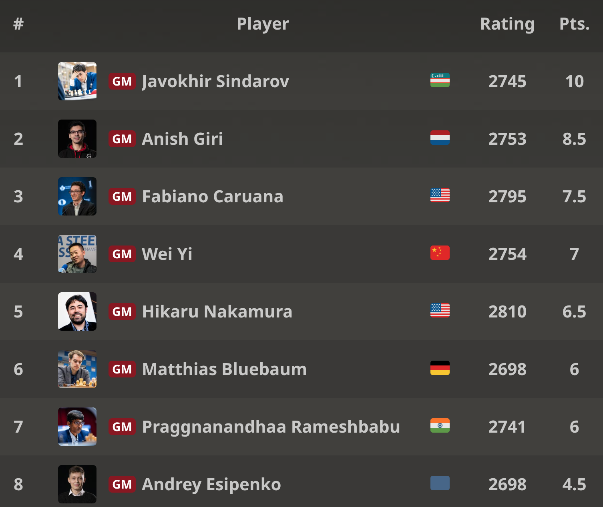

+++
date = 2026-04-16T14:20:23+02:00
title = "Fide candidates 2026: Open"
weight = 9223372036656274184
+++

[Javokhir Sindarov](https://nl.wikipedia.org/wiki/Javohir_Sindarov) heeft overtuigend het kandidatentornooi 2026 gewonnen. In het tweede gedeelte nam hij minder risico maar wist toch te winnen van van Praggnanandhaa. In de herfst van 2026 neemt hij het op tegen Gukesh voor de wereldtitel.

Eindresultaat:

Zijn vriendin(?) [GM Bibisara Assaubayeva](https://nl.wikipedia.org/wiki/Bibisara_Assaubayeva) uit Kazachstan - die overigens ook meespeelt bij de vrouwen - zal best tevreden zijn met het resultaat!

<!--
.image Bibisara.jpg
-->

In het volgend filmpje zien we hoe de jongeman gefeliciteerd wordt door de president van zijn land:


Je kan de video ook bekijken op [dropbox](https://www.dropbox.com/scl/fi/3t8yl73l68sb9dzpy6hr8/Javokhir-Sindarov-speaks-with-the-President-of-Uzbekistan-after-Winning-Candidates.mp4?rlkey=wdecv7w5txvzqucdepkn9gdbf&dl=0)
