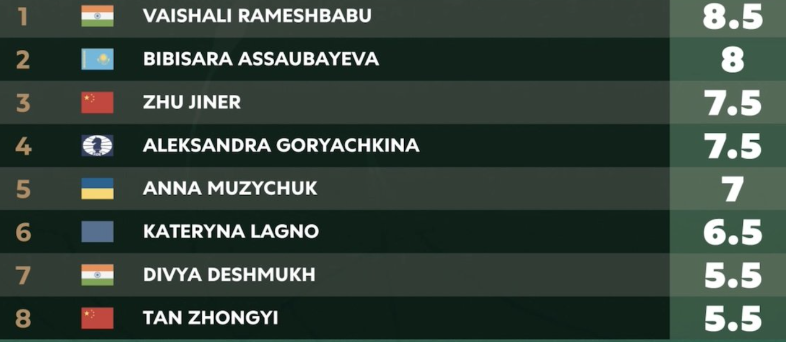

+++
date = '2026-04-16T14:49:48+02:00'
title = 'Fide candidates 2026: Woman'
+++

<!--
.image vaishali.png
-->

[Rameshbabu Vaishali](https://nl.wikipedia.org/wiki/Rameshbabu_Vaishali) heeft het kandidatentornooi bij de vrouwen gewonnen.  In tegenstelling tot haar jongere broer as ze helemaal geen favourite maar ze wist het voordeel te behalen door in de laatste ronde te winnen van Katryna Lagno.

Zal ze in het najaar in staat zijn om [Ju Wenjun](https://nl.wikipedia.org/wiki/Ju_Wenjun) te verslaan voor de wereldtitel.

Het eindresultaat:

<!--
.image result.png
-->

Een afbeelding van broer en zus Rameshbabu:

<!--
.image ram.jpg
-->

Tenslotte nog een filmpje over haar reactie na haar winst:

<!--
.tube https://www.youtube.com/watch?v=ikDIYE-0nqc
-->


<!--
.dropbox https://www.dropbox.com/scl/fi/y5623dvg8beow4qp9n6kr/Vaishali-I-m-happy-my-dream-came-true-FIDE-Women-s-Candidates-Champion-2026.mp4?rlkey=l0ujenmxcnw6pjs5uk5btmo78&dl=0
-->
Je kan de video ook bekijken op [dropbox](https://www.dropbox.com/scl/fi/y5623dvg8beow4qp9n6kr/Vaishali-I-m-happy-my-dream-came-true-FIDE-Women-s-Candidates-Champion-2026.mp4?rlkey=l0ujenmxcnw6pjs5uk5btmo78&dl=0)

Hier zie je de beslissende partij tegen Katryna Lagno:

<!--
.game vaishali.pgn
-->

&#160;

