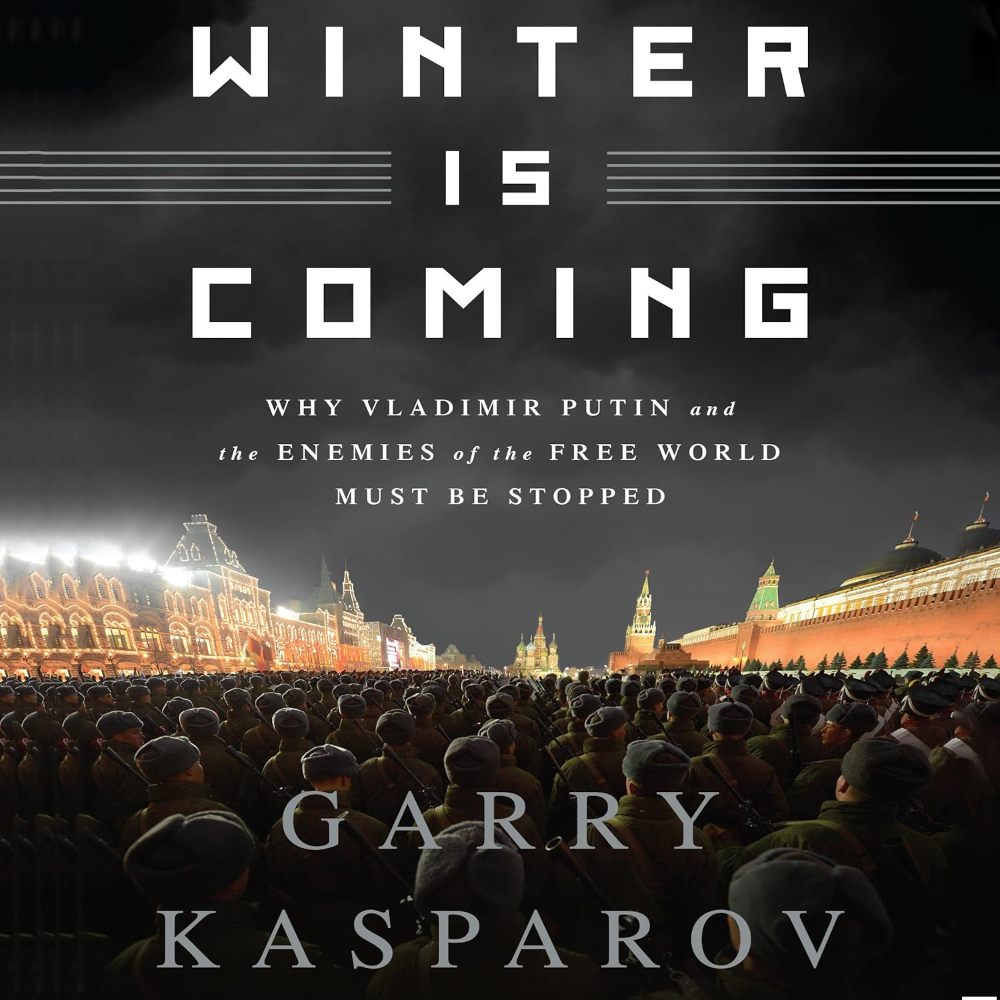
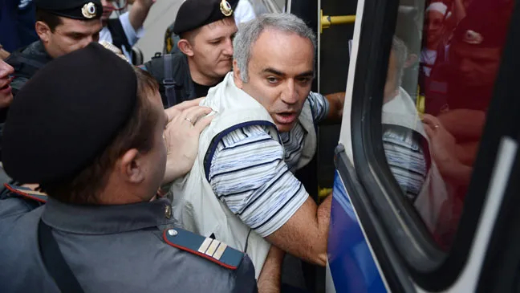

+++
date = '2026-03-20T15:36:37+01:00'
draft = false
title = 'Kasparov in de gevangenis'
+++

[Garri Kasparov](https://nl.wikipedia.org/wiki/Garri_Kasparov), de legendarische wereldkampioen schake, is een verwoed tegenstander van Putin. Hij schreef verschillende boeken ondermeer het welhaast profetische "Winter is Coming"

 

Tijdens een betoging in 2007 werd hij mishandeld en opgesloten.

 

Hij kreeg van slechts 1 man bezoek: zijn aartsvijand Anatoly Karpov



Je kan de video ook bekijken op [dropbox](https://www.dropbox.com/scl/fi/wkvkrnd337y9rx45atg9t/When-Karpov-met-Kasparov-in-jail.mp4?rlkey=9lgfpw50y5sbs99arn790t2j4&st=p17uise2&dl=0)
