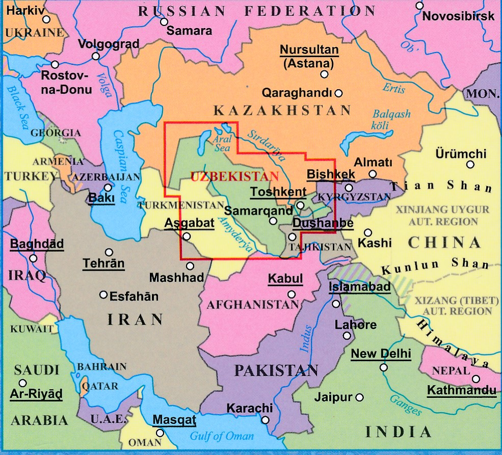
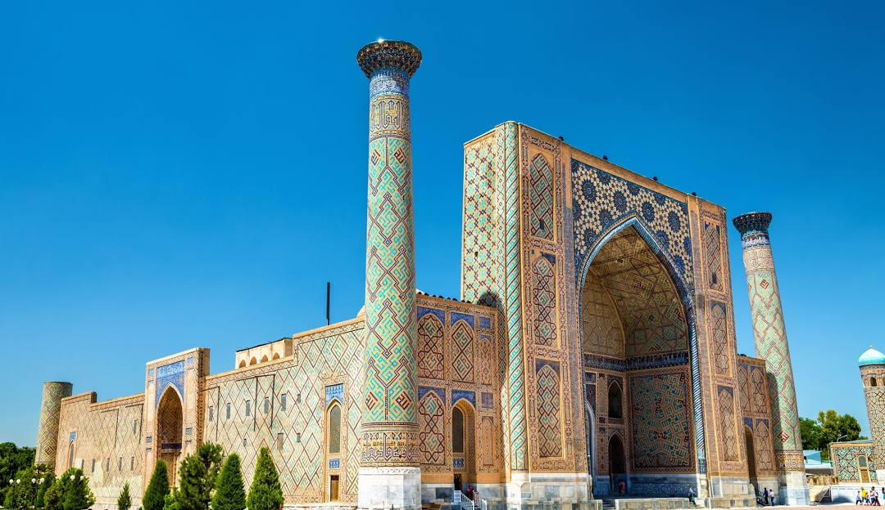
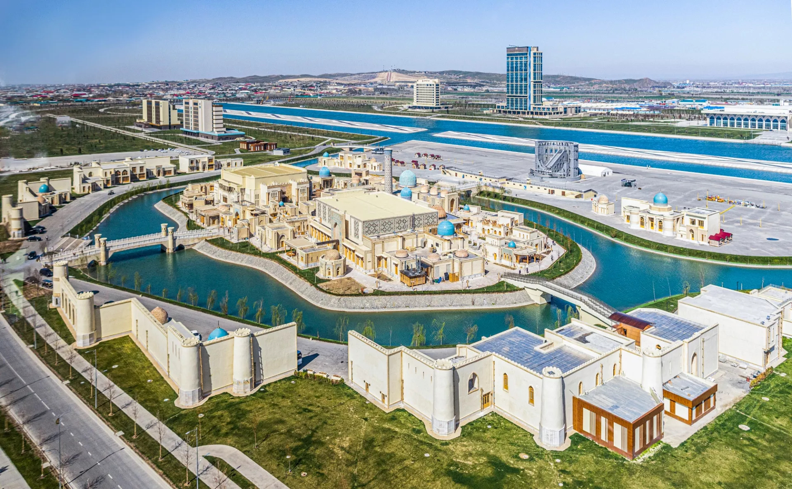
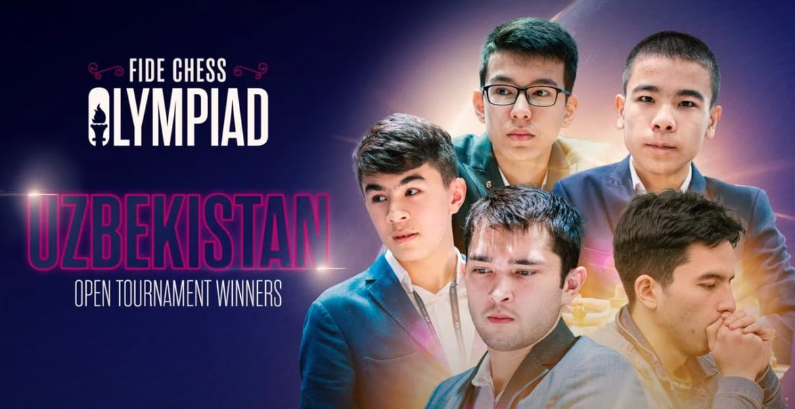

+++
date = 2026-04-05T12:55:04+02:00
title = "Oezbekistan"
weight = 9223372036657229703
+++

[Oezbekistan](https://nl.wikipedia.org/wiki/Oezbekistan) (uitspraak: [uzˈbekistɑn]), officieel de Republiek Oezbekistan (Oezbeeks: Oʻzbekiston Respublikasi), is een land in Centraal-Azië. Het grenst aan Kazachstan, Kirgizië, Tadzjikistan, Afghanistan en Turkmenistan.

Volgens meest recente schattingen telt Oezbekistan 32.120.500 inwoners (1 januari 2017). Dat is een forse stijging vergeleken met het jaar 1926: toen telde het land slechts 4,6 miljoen inwoners.

Itchan Kala, de historische centra van Buchara en van Sachrisabz en Samarkand behoren tot het UNESCO-werelderfgoed.

[Samarkand](https://nl.wikipedia.org/wiki/Samarkand_(plaats)) is zeker een plaats die schakers goed moet liggen!

De 44e Schaakolympiade (ook bekend als de Indiase Schaakolympiade), georganiseerd door de Fédération Internationale des Échecs (FIDE), werd gehouden in Chennai, de hoofdstad van Tamil Nadu, India, van 28 juli tot 10 augustus 2022. De Olympiade bestond uit een open toernooi (open voor alle spelers; van de 937 deelnemende spelers waren er 13 vrouw) en een vrouwentoernooi, plus diverse neven-evenementen ter promotie van het schaken.

Oezbekistan won het open toernooi, dit was hun eerste medaille op het open toernooi in een Schaakolympiade.
