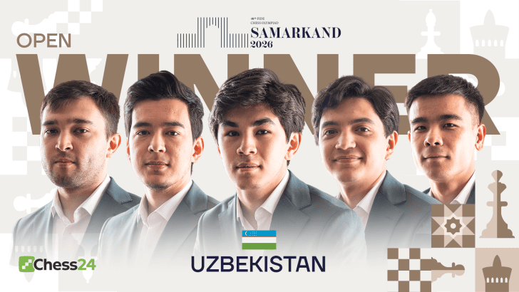
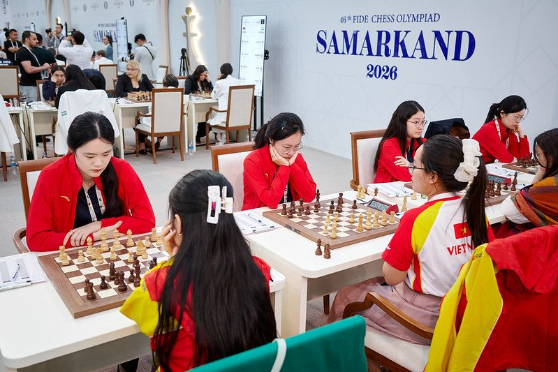
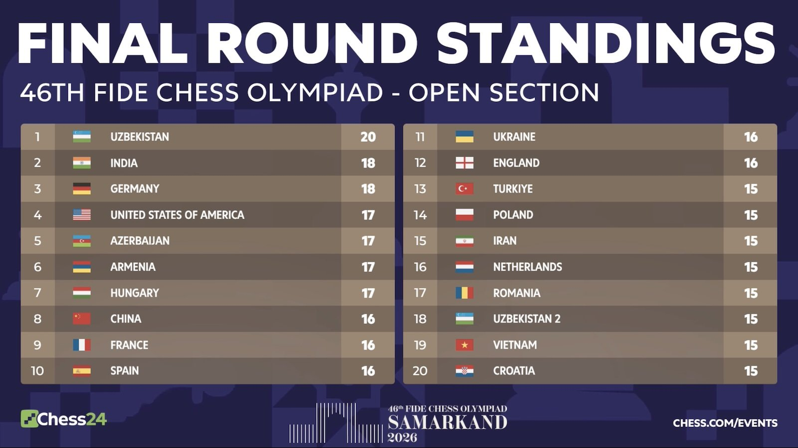
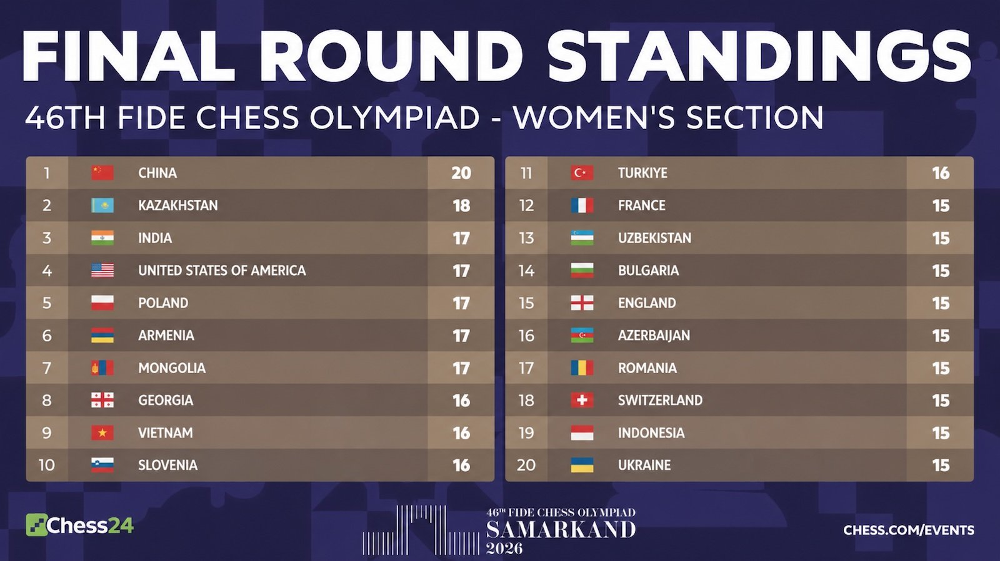
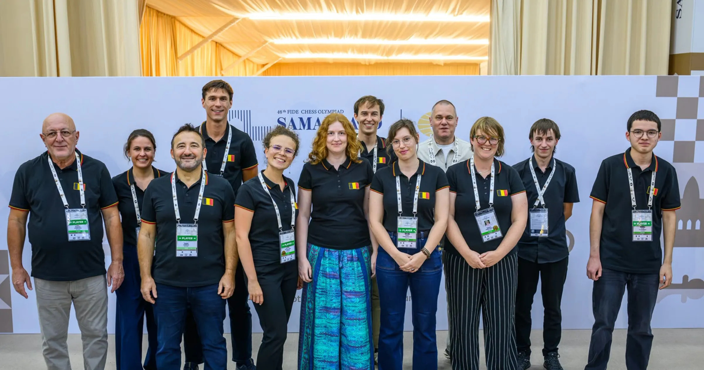

+++
date = '2026-09-29T15:59:40+02:00'
title = '46e Olympiade'
weight = 9223372036641925827
+++

<!--
.image open.png
-->

<!--
.image woman.jpg
-->

De 46e Olympiade is afgelopen. Gastland Uzbekistan werd de verdiende kampioen in het Open tornooi terwijl China het haalde bij de vrouwen.

Eerste bord Nodirbek Abdusattorov van Uzbekistan haalde ook de gouden medaille op het eerste bord en noemde dit:
"This is the proudest moment in my life!" 

Eindstanden:

<!--
.image open-final.jpg
-->

<!--
.image women-final.jpg
-->

Ook Belgie speelde mee en deed het verre van slecht met een 40e plaats op 150, de vrouwen deden het 1 plaats beter en werden 39e.

<!--
.image belgie.jpg
-->

