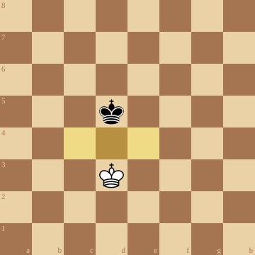
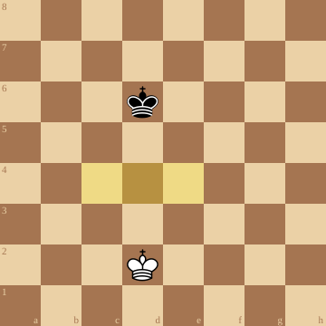

+++
date = 2026-03-16T16:34:18+01:00
title = "Oppositie van de koningen"
weight = 9223372036658940949
+++

'Oppositie' is een belangrijk begrip in het spelen van een schaakeindspel.

In het eindspel wordt de koning belangrijker: hij verlaat zijn schuilplaats en neemt actief deel aan het gevecht.

Niet zelden komt het tot een confrontatie tussen de beide monarchen en de ene koning wil de andere zoveel mogelijk belemmeren.

Koningen staan nooit naast elkaar. Ze kunnen wel in *oppositie* gaan staan.

De koning die de oppositie inneemt, neemt belangrijk terrein af van zijn tegenstander.

Er bestaan ook andere - minder belangrijke - vormen van oppositie zoals de verre oppositie

Oefening: Wit speelt en neemt de oppositie.

&#160;

