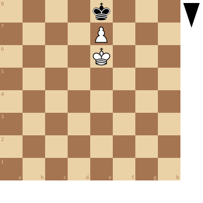
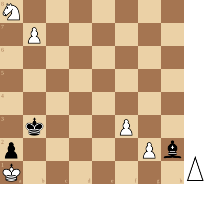

+++
date = '2026-04-24T16:19:53+02:00'
title = 'Pat: het ultieme redmiddel'
+++

<!--
.diagram black:Ke8; white:e7,Ke6
-->

Een speler staat *pat* indien:

- hij aan zet is
- *niet* schaak staat
- geen enkel stuk *reglementair* kan verzetten!

Vele schakers denken dat dit toch wel erg zeldzaam is.

Misschien is dit wel zo, maar toch kan streven naar pat het laatste redmiddel zijn.

Schaken is een spel met vreemde regels maar het zijn precies deze die de partij extra kruiden.

De volgende stelling maakt dit duidelijk:

In deze stelling weet Wit (aan zet) toch te ontsnappen aan het dreigend mat!


Je kan de video ook bekijken op [dropbox](https://www.dropbox.com/scl/fi/rmyvzi4cchkjr2wwrx6nn/This-Looks-Hopeless-But-White-have-hope.mp4?rlkey=lbd612ofm97obyt7xcbiqi7ow&dl=0)

Of speel hier na:

<!--
.puzzle puzzle.pgn
-->

(Je kan de partij <a href="puzzle.pgn">hier</a> downloaden in PGN formaat)

&#160;

