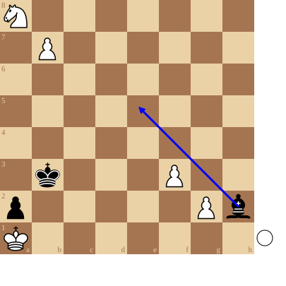

+++
date = '2026-04-24T16:19:53+02:00'
title = 'Pat: het ultieme redmiddel'
+++

Een speler staat *pat* indien:

- hij aan zet is
- *niet* schaak staat
- geen enkel stuk *reglementair* kan verzetten!

Vele schakers denken dat dit toch wel erg zeldzaam is.

Misschien is dit wel zo, maar toch kan streven naar pat het laatste redmiddel zijn.

<!--
.diagram white: Ka1,Na8,b7,f3,g2; black: Kb3,Bh2,a2; arrow: h2e5
-->

In deze stelling weet Wit (aan zet) toch te ontsnappen aan het dreigend mat!

<!--
.tube https://www.youtube.com/watch?v=Q21Xq636IDY&list=PLlN1WdzKJmlLS17Yu35d7HPJqvpL9VKwM
-->

<!--
.dropbox https://www.dropbox.com/scl/fi/rmyvzi4cchkjr2wwrx6nn/This-Looks-Hopeless-But-White-have-hope.mp4?rlkey=lbd612ofm97obyt7xcbiqi7ow&dl=0
-->
Je kan de video ook bekijken op [dropbox](https://www.dropbox.com/scl/fi/rmyvzi4cchkjr2wwrx6nn/This-Looks-Hopeless-But-White-have-hope.mp4?rlkey=lbd612ofm97obyt7xcbiqi7ow&dl=0)
