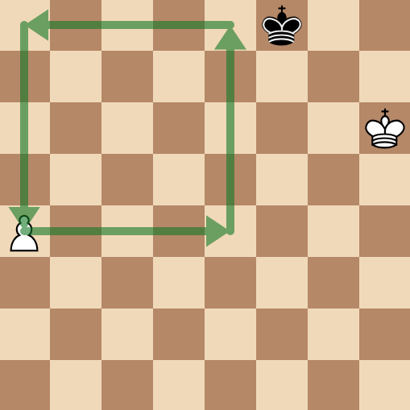
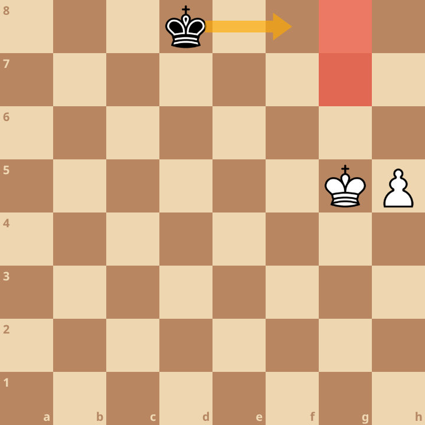
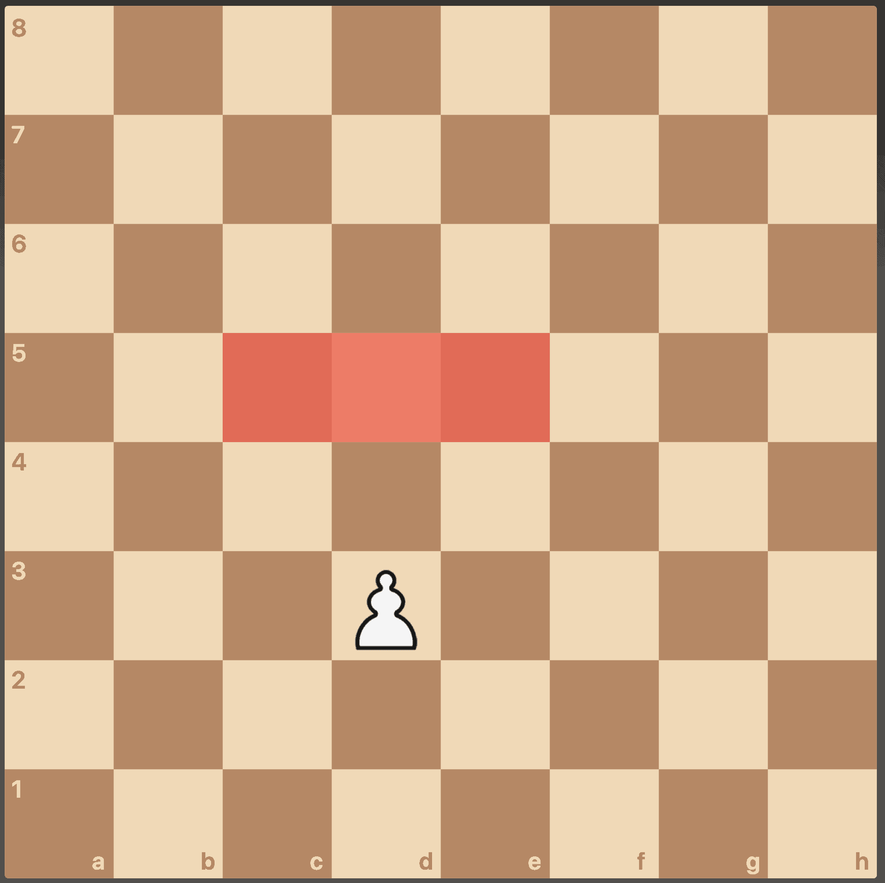
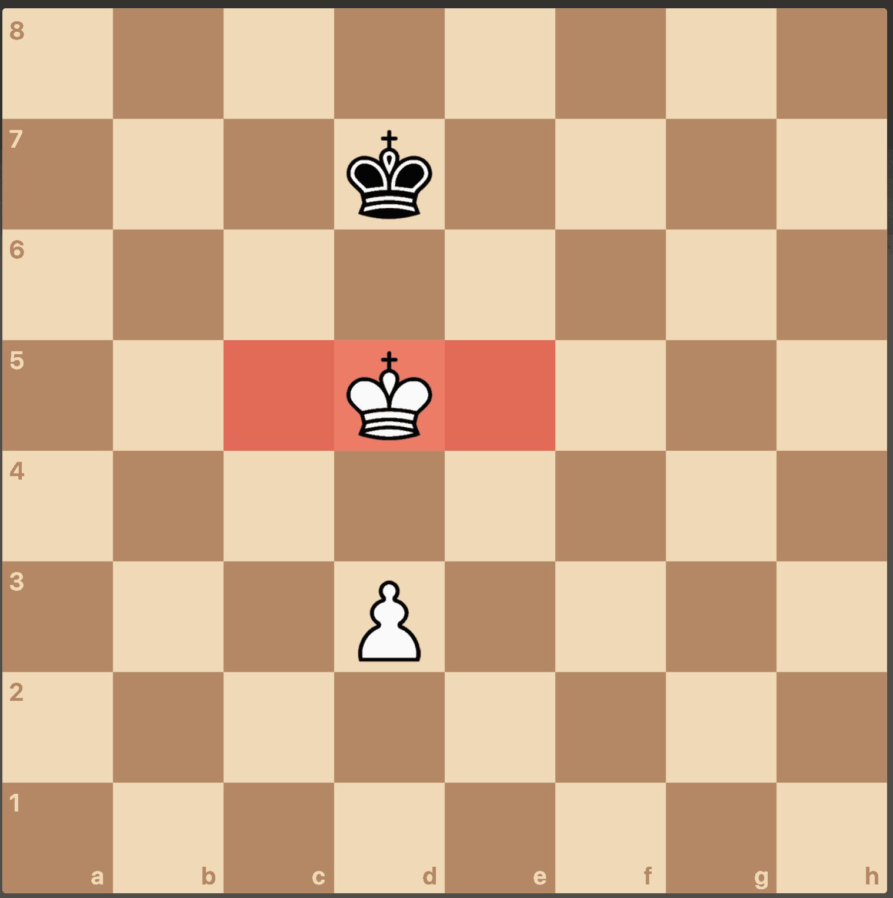
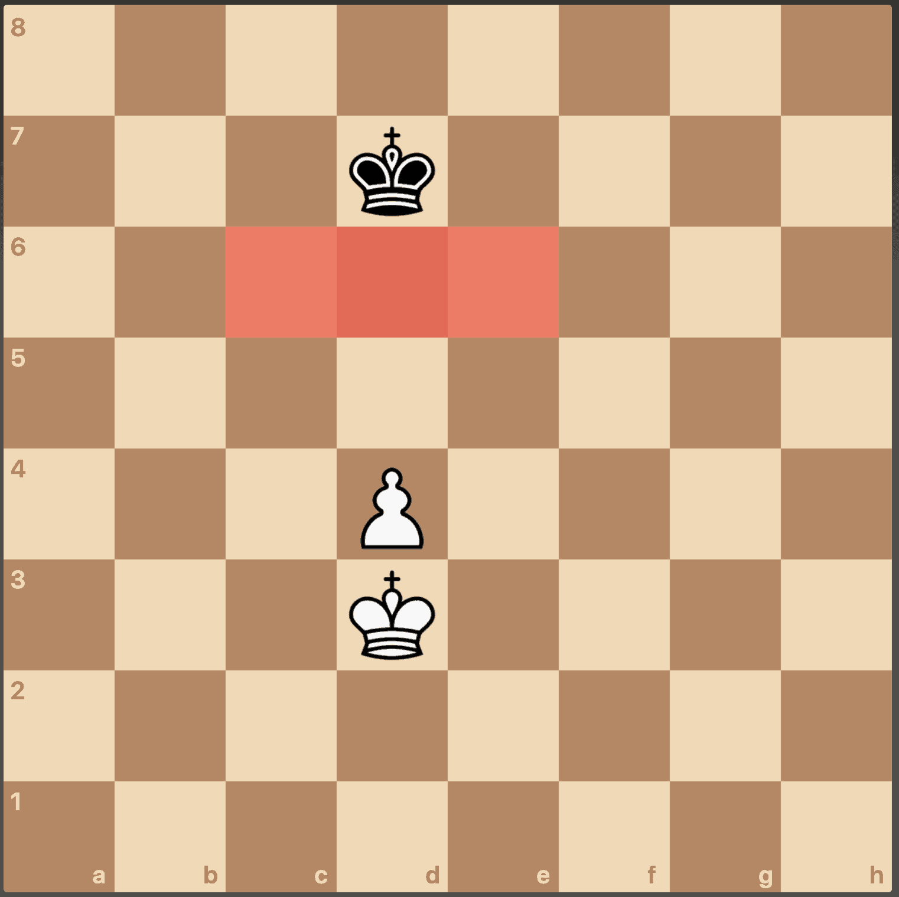
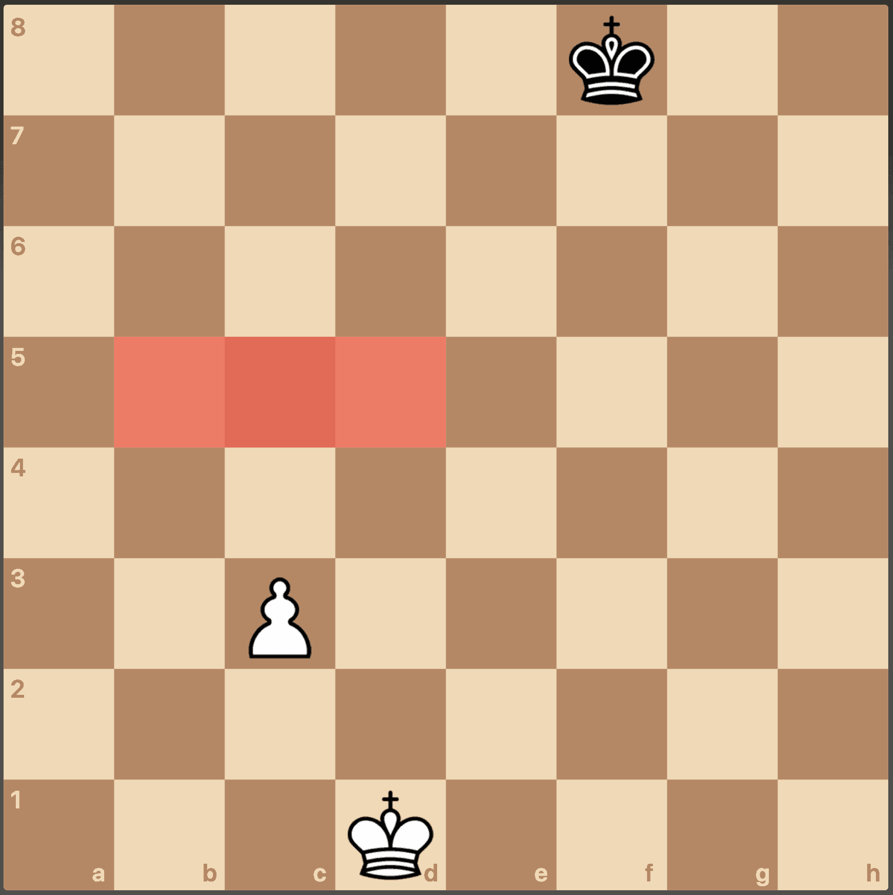
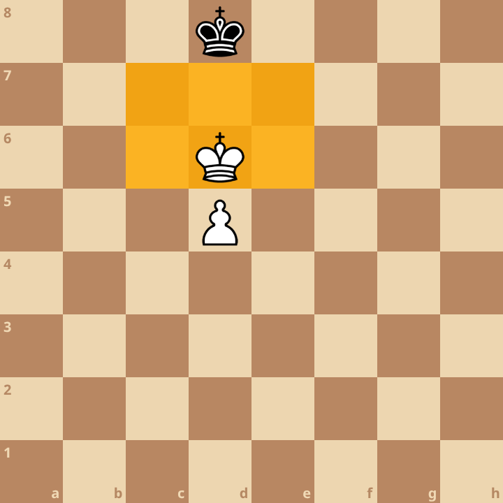

+++
date = '2026-03-16T16:15:13+01:00'
title = 'Basis pionneneindspelen'
+++

Pionnen zijn belangrijk in nagenoeg elk eindspel.
Een voorsprong van 1 pion is dikwijls al genoeg om de partij te winnen.

Toch is het nog niet zo eenvoudig om de pion succesvol naar de eindmeet te loodsen.

Er zijn een aantal belangrijke regels.

## De regel van het vierkant

Als de verdedigende koning het vierkant kan binnenstappen, dan controleert hij de pion.
In het andere geval is de pion steeds sneller bij het promotieveld.

## Sleutelvelden

Sleutelvelden zijn velden die de aanvallende koning verzekeren van de promotie.
De aanvaller zal er alles aan doen om één van deze velden te veroveren. De verdediger gaat dit proberen te verhinderen door gebruik te maken van de oppositie.

Let op: het betekent steeds dat de koning voor zijn pion moet geraken.

## Sleutelvelden bij een randpion

Indien de witte koning g7 of g8 kan bereiken wint hij.
Daarom moet Zwart zich haasten naar c7 of c8.

## Sleutelvelden bij andere pionnen

Indien de pion zich nog op de eigen helft bevindt, zijn er 3 sleutelvelden. Indien de pion zich op de vijandelijk helft bevindt, zijn er 6 sleutelvelden!

In de volgende stelling heeft Wit een sleutelveld verovererd:

In de volgende stelling weet Zwart te verhinderen dat Wit een sleutelveld verovert:

In de volgende stelling is de partij gewonnen voor Wit indien hij aan zet is, zo niet dan eindigt het op remise.

De volgende stelling is de belangrijkste om te onthouden: Wit wint altijd

