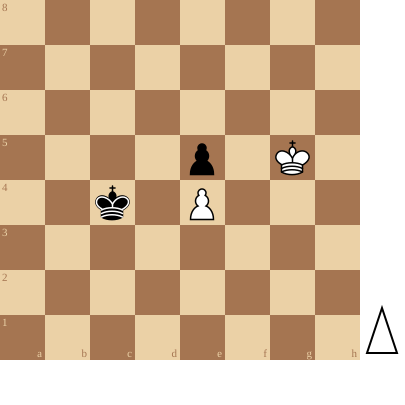

+++
date = '2026-05-02T18:34:31+02:00'
title = 'Pion tegen pion: de dansende koningen'
+++

<!--
.diagram game.pgn
-->

Dit is een veel voorkomende positie en ... wees voorzichtig: elke misstap is fataal.

Als Wit - aan zet - goed speelt, dan wint hij de partij!

(Je kan de partij <a href="game.pgn">hier</a> downloaden in PGN formaat)

&#160;

