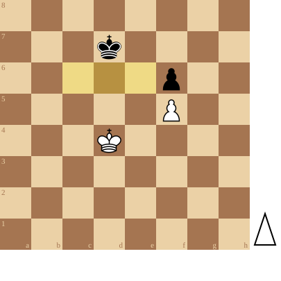

+++
date = 2026-05-02T18:40:16+02:00
title = "Pionnen op dezelfde lijn 1"
weight = 9223372036654876191
+++

<!--
.diagram white:Kd4,f5; black: Kd7,f6; mark:c6,d6,e6
-->

Wit kan de zwarte pion veroveren indien hij 1 van de 3 (aan beide zijden) aanliggende velden kan betreden.

Is hij aan zet, dan neemt hij de oppositie en wint hij!

Is Zwart aan zet dan neemt deze de oppositie en is de partij remise.

<!--
.puzzle game.pgn
-->

(Je kan de partij <a href="game.pgn">hier</a> downloaden in PGN formaat)

&#160;

