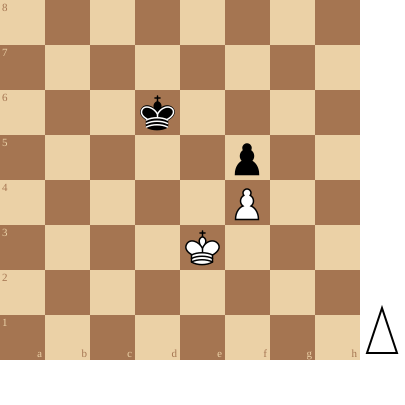

+++
date = '2026-05-02T18:48:33+02:00'
title = 'Pionnen op dezelfde lijn 2'
+++
<!--
.diagram game.pgn
-->

Deze stelling lijkt heel erg op de stelling die we hebben gezien in ['Pionnen op dezelfde lijn 1'](articles/pionpion2).

Het resultaat is echter steeds remise: Wit - aan zet - kan weliswaar de pion winnen maar dit is onvoldoende om te winnen: Zwart verhindert immers dat Wit de sleutelvelden bereikt.

<!--
.puzzle game.pgn
-->

(Je kan de partij <a href="game.pgn">hier</a> downloaden in PGN formaat)

&#160;

