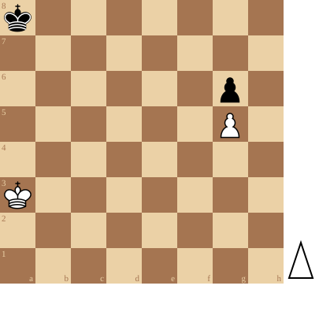

+++
date = 2026-05-03T11:33:58+02:00
title = "Pionnen op dezelfde lijn: oefening"
weight = 9223372036654815369
+++

<!--
.diagram game.pgn
-->

Dit is een mooie oefening: Wit mag doen wat hij wil, Zwart kan steeds verhinderen dat hij wint.

<!--
.puzzle game.pgn
-->

(Je kan de partij <a href="game.pgn">hier</a> downloaden in PGN formaat)

&#160;

