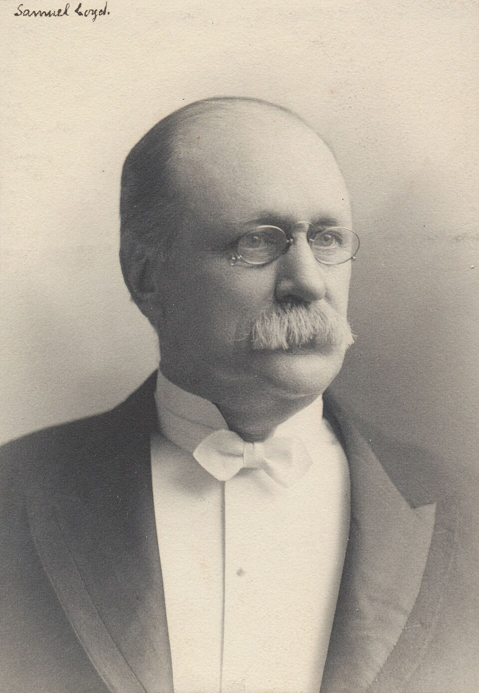
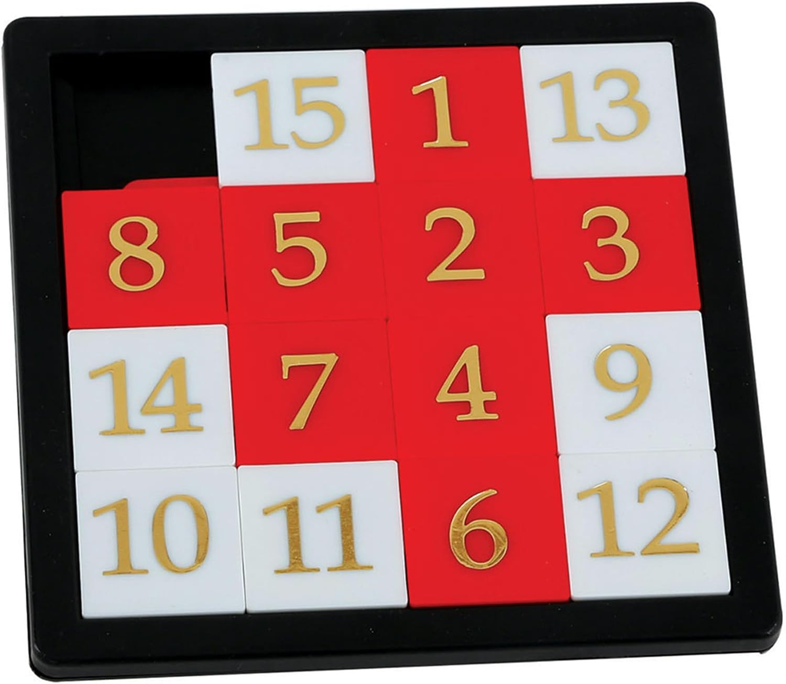

+++
date = '2026-08-30T18:01:39+02:00'
title = 'Sam Loyd (1)'
weight = 9223372036644510508
+++

<!--
.image image.jpg
-->

[Samuel Loyd](https://en.wikipedia.org/wiki/Sam_Loyd) (30 januari 1841 – 10 april 1911) was een Amerikaans schaker, eemn componist van schaakstudies, allerhande puzzels.

<!--
.image slide.jpg
-->

Hij is vooral bekend van zijn [4 x 4 puzzel schuif puzzel](https://en.wikipedia.org/wiki/Sliding_puzzle). Volledig verkeerd natuurlijk: hij heeft deze puzzel simpelweg 'geleend' van Noyes Chapman in 1880. Toch bracht hij een nuance aan de puzzel: hij wisselde  de '14' en de '15' en loofde een beloning van 1000 dollar uit aan diegene die de puzzel kon oplossen!

Zijn schaakcomposities zijn anders dan anders en ze zullen er zeker een paar van tonen.

Als toemaatje een TV interview met Robert Fischer waarin hij de 4 x 4 schuif puzzel oplost!

<!--
.yt QxvnEwvgfeI
-->


Je kan de video ook bekijken op [dropbox](https://www.dropbox.com/scl/fi/rnprnkhqqijj8zs9zyyfb/Full_Appearance_Bobby_Fischer_solves_a_15_puzzle.mp4?rlkey=87nrzryhq4wei6daaq4wsm8pt&dl=0)

