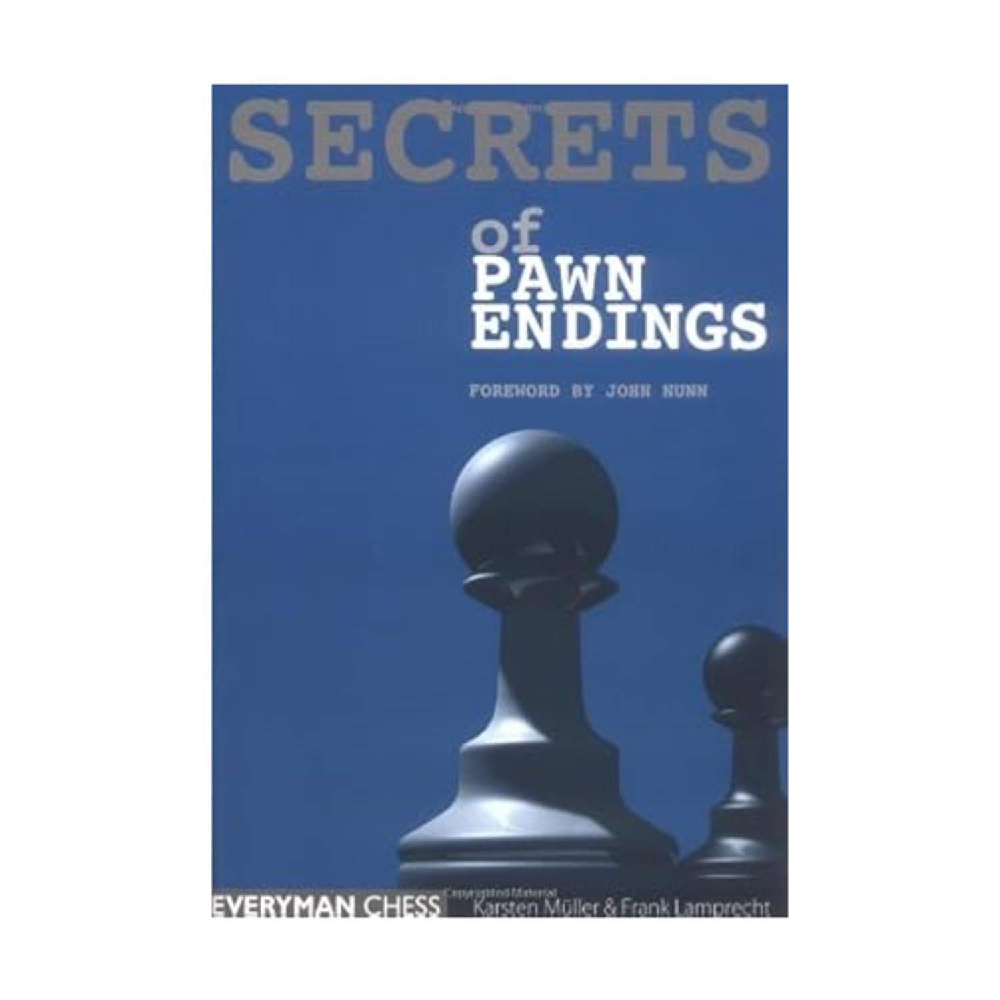

+++
date = '2026-04-09T14:06:26+02:00'
title = 'Secrets of pawn endings'
+++

Een boek dat ik elke schaker kan aanraden is *Secrets of pawn endings/Karsten Müller*

[Karsten Müller](https://en.wikipedia.org/wiki/Karsten_M%C3%BCller) is een Duits grootmeester en wiskundige die zich specialiseert in eindspeltheorie. Over dit ondetwerp schreef hij verschillende boeken. 

Behalve boekmaterialen heeft hij voor Chessbase ook een CD-ROM collectie uitgegeven over dit onderwerp.

<!--
.image secret.jpg
-->

