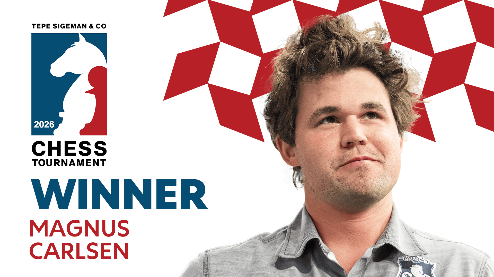
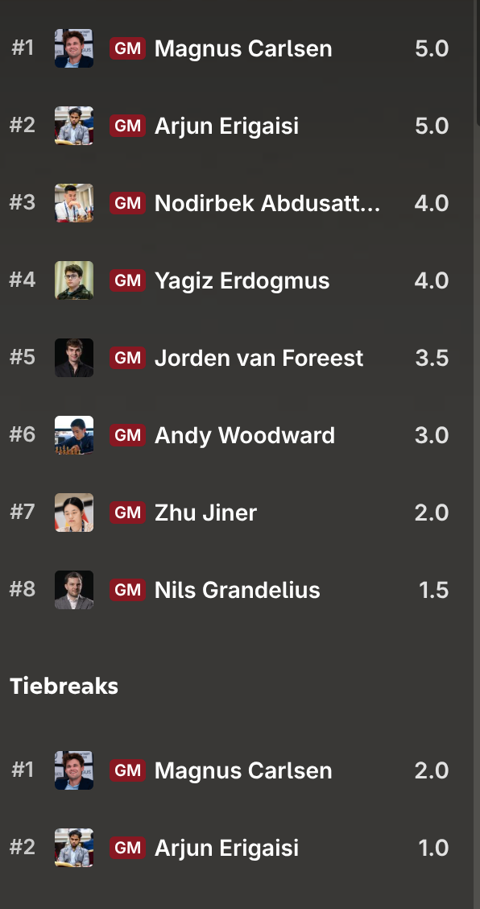

+++
date = '2026-05-17T13:45:10+02:00'
title = 'TePe Sigeman chess tournament'
+++

<!--
.image sigeman.png
-->

Het [TePe Sigeman chess tournament'](https://en.wikipedia.org/wiki/TePe_Sigeman_%26_Co_chess_tournament) wordt elk jaar georganiseerd in Malmo (Zweden).

In de lijst van winnaars vind je legendarische namen terug: Sokolov, Korchnoi, Gelfand, Polgar, Timman, Short, Giri, Svidler, Abdusattarov en ... Sindarov !

Dit jaar was het tornooi sterker dan ooit: niemand minder dan Carlsen was aanwezig. Er waren ook 3 outliers: de 2 jonge kerels Yagiz Erdogmus (14 j.) en Andy Woodward (15 j.) werden vergezeld door de nummer 2 bij de vrouwen [Zhu jiner](https://en.wikipedia.org/wiki/Zhu_Jiner).

Carlsen verloor tegen zijn vroegere secondant Jorden van Foreest. Maar toen werd het beest wakker ...

Het resultaat:

<!--
.image result.png
-->

