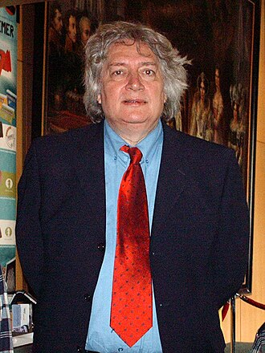
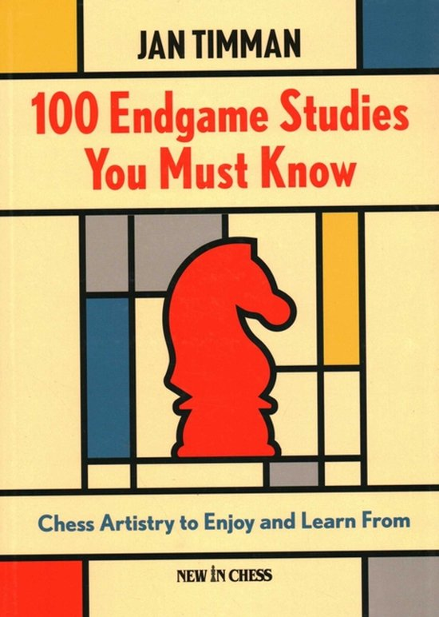
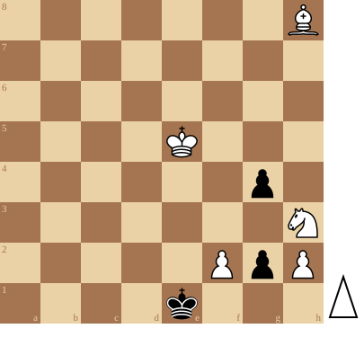

+++
date = 2026-05-19T17:23:17+02:00
title = "Jan Timman"
weight = 9223372036653412010
+++

<!--
.image timman.jpg
-->
 

[Jan Hendrik Timman](https://nl.wikipedia.org/wiki/Jan_Timman) (Amsterdam, 14 december 1951[1] – Arnhem, 18 februari 2026) was een Nederlandse schaakgrootmeester. Hij was negenmaal Nederlands schaakkampioen. Hij behoorde geruime tijd tot de wereldtop en was ooit dicht bij het wereldkampioenschap. Op de top van zijn carrière werd hij beschouwd als *The Best of the West*.

Timman was niet alleen een fenomenaal speler. Hij was ook een belangrijk auteur en schaak-analyst.

Hij was ook een uitstekend componist van eindspelstudies.

<!--
.image 100.jpg
-->

Zijn boek *100 Endgame Studies You Must Know* neem ik steevast mee op reis.

Hierna volgt een studie van hemzelf.

<!--
.tube https://www.youtube.com/watch?v=RRqpvRpu9hU&list=PLlN1WdzKJmlJS2O3BfaEIrqy8fhf0XiZx&index=21
-->


<!--
.dropbox https://www.dropbox.com/scl/fi/ee00hlpjtcmeuzjphqwvx/In_memory_of_Jan_Timman_1951_2026_RRqpvRpu9hU.mp4?rlkey=1djzdzkroyvx50rapvc4tyfmi&st=ks94wa8n&dl=0
-->
Je kan de video ook bekijken op [dropbox](https://www.dropbox.com/scl/fi/ee00hlpjtcmeuzjphqwvx/In_memory_of_Jan_Timman_1951_2026_RRqpvRpu9hU.mp4?rlkey=1djzdzkroyvx50rapvc4tyfmi&st=ks94wa8n&dl=0)

<!--
.diagram timman.pgn
-->

<!--
.game timman.pgn
-->

&#160;

