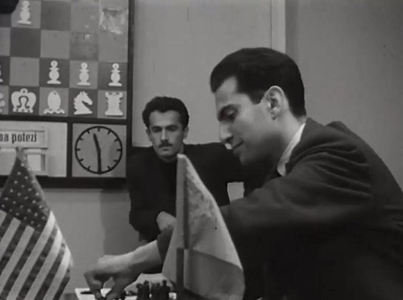

+++
date = 2026-07-12T16:10:46+02:00
title = "Tal: tragisch en groots"
weight = 9223372036648750761
+++

<!--
.image tal.jpg
-->

Michail Nechemevitsj Tal (Lets: Mihails Tāls) (Riga, 9 november 1936 – Moskou, 28 juni 1992) was een Lets schaker en de achtste wereldkampioen.

Zoals elke wereldkampioen, was hij een man met uitzonderlijke talenten en uitzonderlijke kwalen.

Van hem is de volgende uitspraak bekend:
*er zijn correcte offers, en er zijn de mijne*

De volgende video toont het laatste gedeelte van zijn leven.

<!--
.yt https://www.youtube.com/watch?v=PlPGEQSG1KE
-->


Je kan de video ook bekijken op [dropbox](https://www.youtube.com/watch?v=PlPGEQSG1KE)

Vanzelfsprekend hoort hier ook een partij bij:

<!--
.game game.pgn
-->

<!-- Game begin -->
<link href="/okra/js/lichess/pgn/lichess-pgn-viewer.css" type="text/css" rel="stylesheet" />

&#160;

<!-- Game end -->
