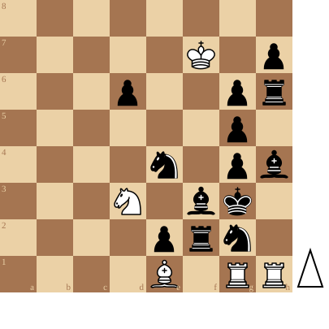

+++
date = 2026-05-19T15:01:21+02:00
title = "Triangulatie"
weight = 9223372036653420526
+++

In

<!--
.link articles/pionpion1/index.md
-->
[Pion tegen pion: de dansende koningen]() (artikel)

zie je een goed voorbeeld van triangulatie: Wit maakt een driehoekje om uiteindelijk op het beslissende veld terecht te komen.

Een prachtig voorbeeld van triangualtie vind je terug in de studie van [Alexey Troitsky](https://en.wikipedia.org/wiki/Alexey_Troitsky).
Troitsky was een legendarische componist die als geen andere schaakideeën wist te illustreren.

<!--
.diagram game.pgn
-->

Je kan de video bekijken op [dropbox](https://www.dropbox.com/scl/fi/4qj3b0k078myc39wt0uk7/The_INCREDIBLE_Puzzle_Stockfish_Can_t_Crack_6W2c.mp4?rlkey=7zntr7alddwqohwwxgido6tns&st=q4eim7r2&dl=0)

<!--
.game game.pgn
-->

<!-- Game begin -->
<link href="/okra/js/lichess/pgn/lichess-pgn-viewer.css" type="text/css" rel="stylesheet" />

&#160;

<!-- Game end -->

