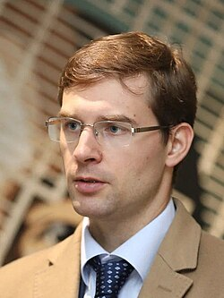

+++
date = '2026-09-29T15:50:59+02:00'
title = 'Timur Turlov elected President of FIDE'
weight = 9223372036641926348
+++

<!--
.image timor.jpg
-->

[Timor Turlov](https://en.wikipedia.org/wiki/Timur_Turlov), de 38-jarige miljardair werd de nieuwe voorzitter van de FIDE.

Minstens even belangrijk is dat oud-wereldkampioen [Viswanathan (Vishy)Anand](https://nl.wikipedia.org/wiki/Viswanathan_Anand) aanblijft als vice-president.

Onderstaande tekst werd overgenomen uit de website van [Fide](https://en.wikipedia.org/)

"""

**Timur Turlov, President of the Kazakhstan Chess Federation, was elected President of the International Chess Federation (FIDE). The elections were held on 26 September at the FIDE General Assembly, alongside the 46th Chess Olympiad, in Samarkand, Uzbekistan. Turlov won in the second round, with 110 votes. At 38, he becomes the second youngest FIDE President ever elected.**

Delegates representing 196 national chess federations took part in the election, with three candidates competing in the race. In the first round, Turlov received 96 votes, Wadim Rosenstein (Germany) received 76 votes, and Jan Henric Buettner (Germany) received 20 votes. In total, 192 votes were cast.

In the second round, which followed two hours later, Turlov won by a vote of 110 to 85 (196 votes in total), becoming the eighth President of FIDE. He succeeded **Arkady Dvorkovich**, who served two terms as President, from 2018 to 2026.

“We are all one family, and we will continue working as one. This is a great responsibility and a vote for a better future of our sport,” Timur Turlov said following the result.

“I am grateful to everyone who supported my campaign and to everyone who took part in this election. We may have different opinions, but we all share one belief – that chess is important and that we can do much more to develop it around the world by making our Member Federations stronger and more independent,” he added.

“I look forward to moving chess forward and giving the game the spotlight it deserves,” Turlov concluded.

In his congratulations to Timur Turlov, former FIDE President Arkady Dvorkovich wished him success in his work.

“Timur has already done a great deal for chess, and I am sure he will do even more now as FIDE President. He and his team have the energy, a clear plan, and resources to deliver and this election result shows Timur has significant backing. We are all one family, and we all share the same goal – for chess to be bigger, better and stronger in the world,” Dvorkovich said.

Abdulla Aripov, Prime Minister of Uzbekistan, host of both the 46th FIDE Olympiad and the FIDE Congress, greeted those attending and noted the country’s commitment to promoting chess and friendship in the world.

**Biography: Timur Turlov**

Timur Turlov (born on 13 November 1987) is an economist and serves as the Chief Executive Officer of Freedom Holding Corp., an international financial services group listed on the NASDAQ Stock Exchange, with a capitalisation of nearly $11 billion.

Since January 2023, he has served as President of the Kazakhstan Chess Federation. Turlov is also the founding President of the International School Chess Federation (ISCF), established in September 2024.

Playing chess since childhood, Turlov – a father of six – has supported chess tournaments in Kazakhstan and abroad. Over three years, Freedom Holding Corp. allocated approximately $30 million to the development of chess in Kazakhstan and supported the staging of more than 20 major international FIDE tournaments, becoming one of the largest private sponsors of the game worldwide. 

In September 2024, together with FIDE, Turlov initiated the founding of the International School Chess Federation and serves as its President. With a strong belief in the value of education and the role of chess in personal and professional development, the ISCF works with schools, educational organisations, NGOs and national federations to expand chess in education and promote the game among young people worldwide.  

He chairs the Turkic Chess Association, which brings together the national chess federations of Azerbaijan, Kazakhstan, Kyrgyzstan, Turkmenistan, Türkiye and Uzbekistan. Under the Association’s auspices, the inaugural Turkic Countries Team Chess Championship was held in Astana in 2026. 

With a deep connection to chess tradition and a strong belief in innovation, Timur Turlov advocates the use of digital solutions to help FIDE and national federations advance modern, transparent and sustainable governance, improve services and provide more effective support for players and chess communities around the world.

"""

