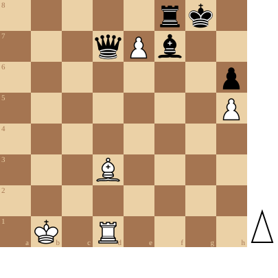

+++
date = '2026-05-18T12:14:00+02:00'
title = 'Underpromotion'
+++

In praktisch alle gevallen promoveert een pion die de achtste rij bereikt tot koningin.

Zoals deze studie toont, kan het echter ook anders ...

<!--
.diagram game.pgn
-->

<!--
.tube https://www.youtube.com/watch?v=eeCwsn5V0Zo
-->


<!--
.dropbox https://www.dropbox.com/scl/fi/ajgim7hnpzrj3on27jj2h/Underpromote_A_Very_Cool_and_Tricky_Endgame_Stud.mp4?rlkey=0f00bw6dr7gjnqvbtxklkl6yz&st=vj2g6gad&dl=0
-->
Je kan de video ook bekijken op [dropbox](https://www.dropbox.com/scl/fi/ajgim7hnpzrj3on27jj2h/Underpromote_A_Very_Cool_and_Tricky_Endgame_Stud.mp4?rlkey=0f00bw6dr7gjnqvbtxklkl6yz&st=vj2g6gad&dl=0)

<!--
.game game.pgn
-->

&#160;

