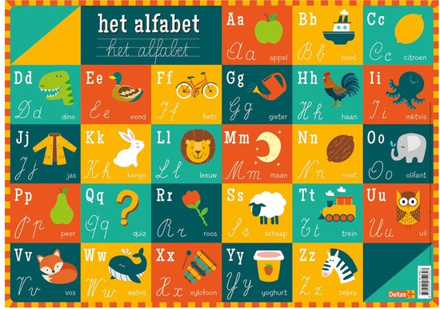
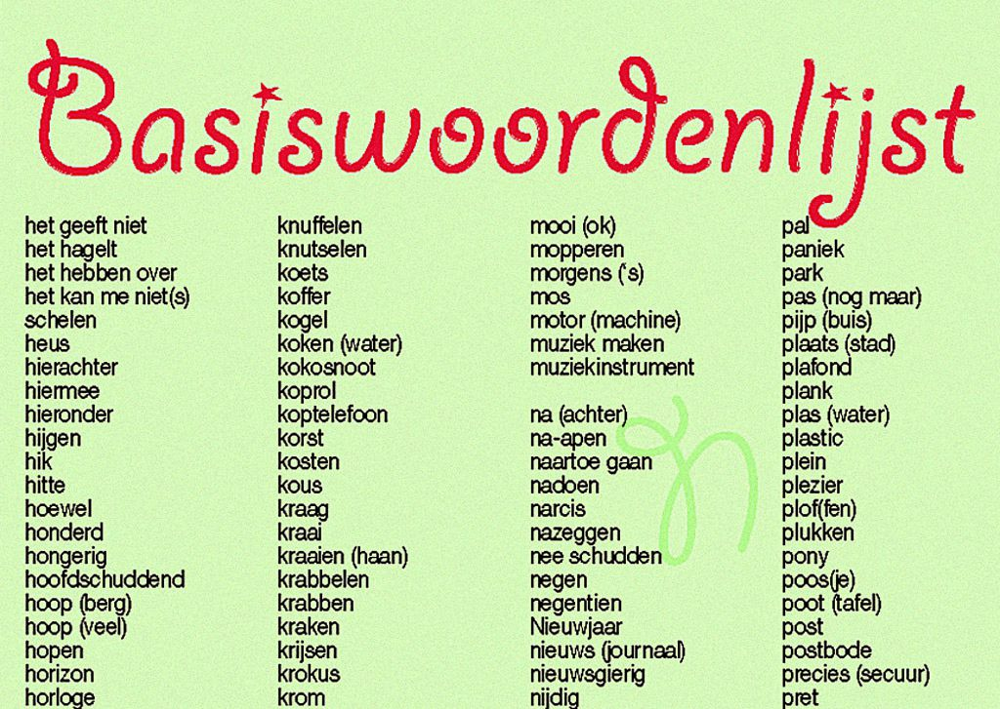
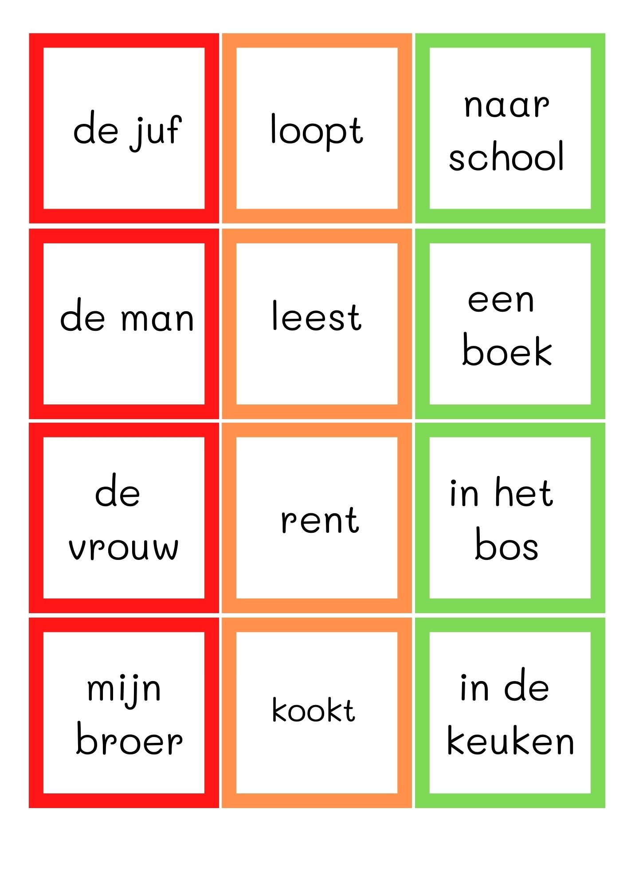
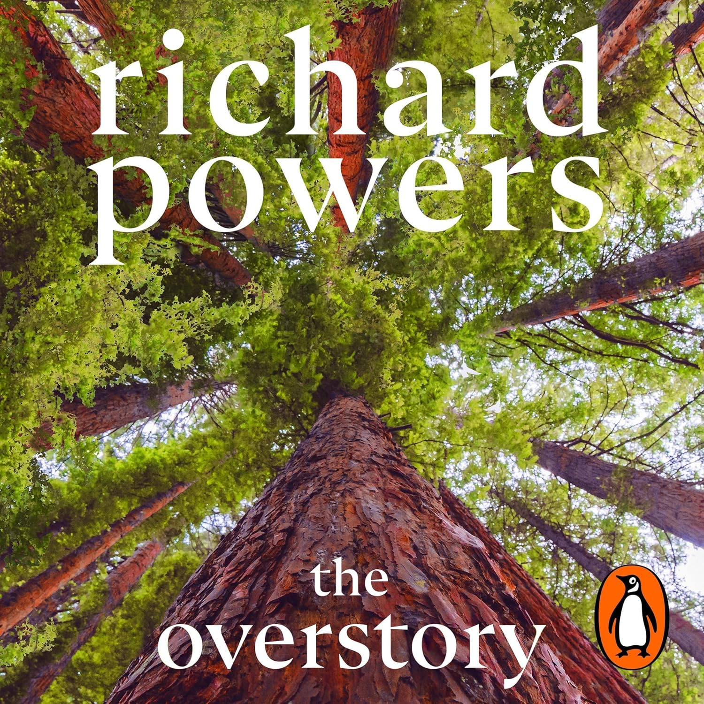

+++
date = 2026-03-26T12:33:52+01:00
title = "Letters, woorden, zinnen, boeken"
weight = 9223372036658091375
+++

Leren schaken betekent tot het uiterste gaan van je mogelijkheden.

Je begint met de *letters*: de elementen van het spel

Je stelt de letters samen tot *woorden*: de mogelijkheden van elk stuk

Je combineert de woorden tot *zinnen*: je eerste partijen

Je maakt *meesterwerken*

De drie eerste stappen zijn voor iedereen weggelegd. De laatste fase wordt bepaald door het talent van de speler.
