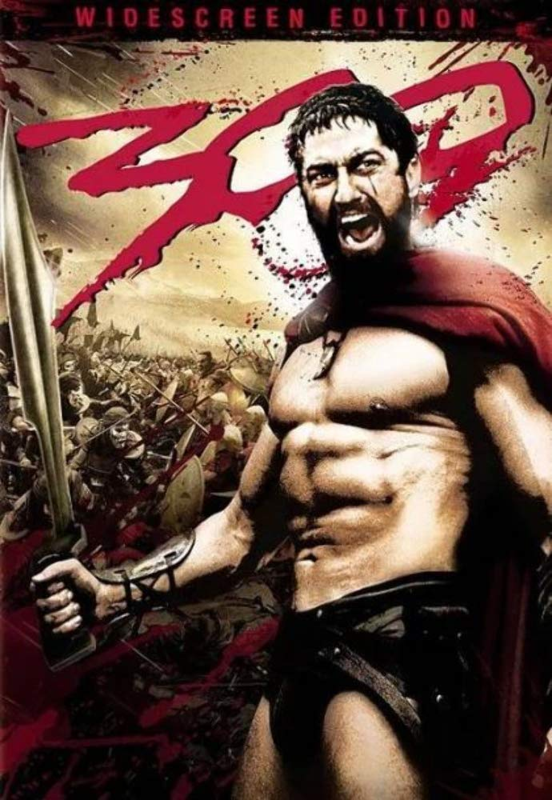
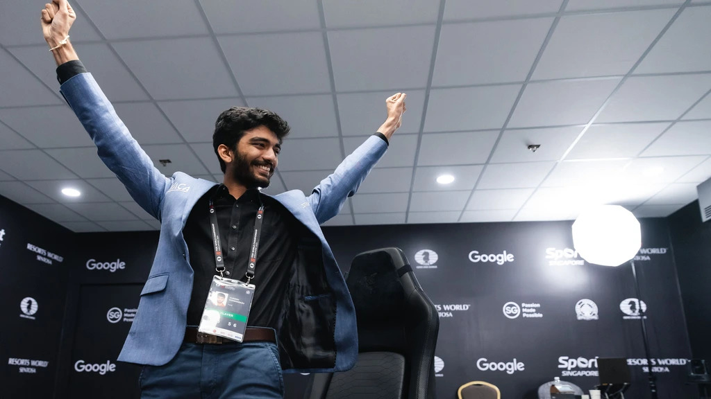
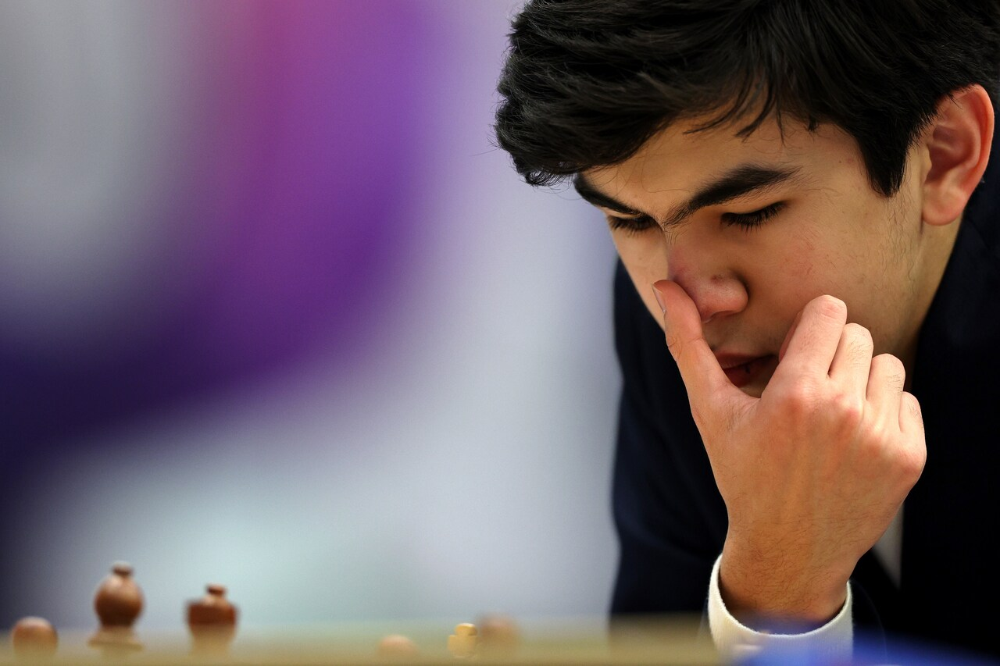

+++
date = '2026-08-07T15:58:35+02:00'
title = 'De wereldkampioenen tot augustus 2026'
+++

<!--
.image held.jpg
-->

Elke sport heeft zijn helden nodig.

Schakers kunnen het heel wat slechter doen dan een (gewezen) wereldkampioen te kiezen.

Toch nog even er aan herinneren dat het wereldkampioenschap 2025-2026 wel al de uitdager Javokhir Sindarov kent die het gaat opnemen tegen regerend wereldkampioen Dommaraju Gukesh maar dat er nog steeds geen datum en geen plaats gekend is!

<!--
.image gukesh.jpg
-->

<!--
.image sindarov.jpg
-->

De volgende video toont een overzicht van alle wereldkampioenen.

<!--
.yt b_lHQ6XiPRg
-->


Je kan de video ook bekijken op [dropbox](https://www.dropbox.com/scl/fi/vmbxa24n6c32697ha0ub1/Every_World_Chess_Champion_Explained_b_lHQ6XiPRg.mp4?rlkey=zjbbihab7ig0c33c9y1mwz8vq&dl=0)
