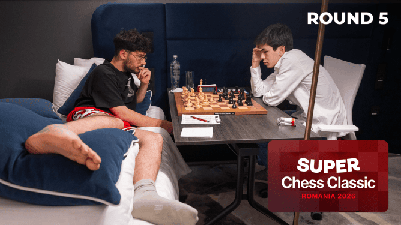
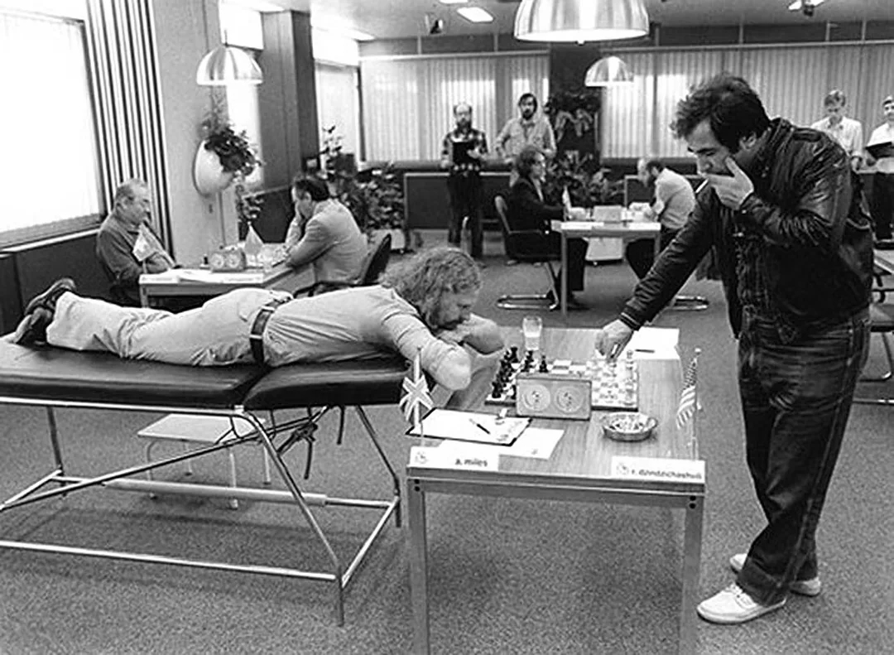
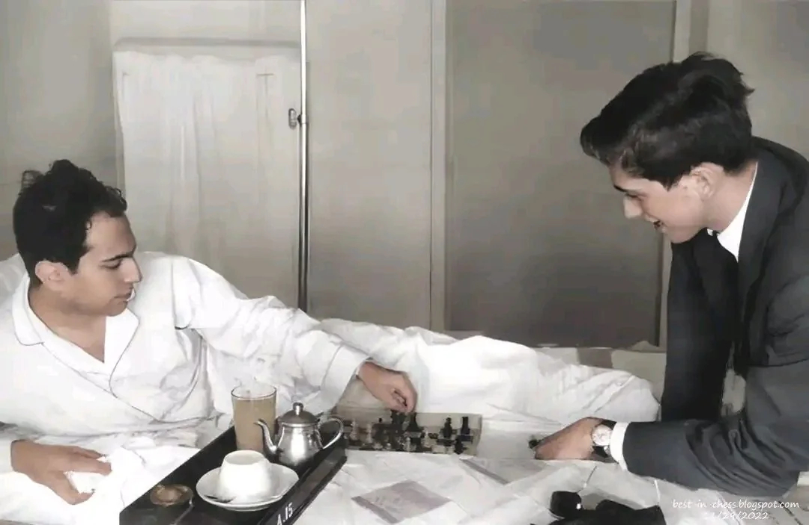

+++
date = 2026-06-14T15:55:07+02:00
title = "Schaken en ziek zijn"
weight = 9223372036651170900
+++

<!--
.image 2008652.80cef3bb.668x375o.56278bad24a4.png
-->

Tijdens de Super Chess Classic Romania 2026 verzwikte [Alireza Firouja](https://nl.wikipedia.org/wiki/Alireza_Firouzja) zijn enkel en speelde zijn partijen vanop zijn bed.

Later diende hij forfait te geven (na een verliespartij tegen Caruana)

Dit was echt niet de eerste keer dat schakers speelden vanop hun ziektebed:

In de volgende afbeelding zie je hoe [Tony Miles](https://nl.wikipedia.org/wiki/Tony_Miles) - Engelands eerste grootmeester - met rugklachten speelde tegen [GM Roman Dzindzichashvili](https://en.wikipedia.org/wiki/Roman_Dzindzichashvili). Dzindzichashvili speelde rechtstaand uit protest!

<!--
.image miles.jpg
-->

Nog meer bekend is het bezoek van Fischer aan Tal tijdens de Curaçao Interzonaal in 1962.
Toen Mikhail Tal ziek werd, was Fischer de enige speler die hem in het ziekenhuis bezocht, een gebaar dat Tal diep raakte en aanleiding gaf tot de iconische foto van de twee die schaken op Tals ziekenhuisbed.

<!--
.image fischer.jpg
-->

