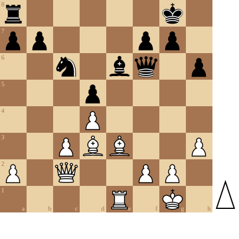

+++
date = 2026-04-02T17:04:50+02:00
title = "Partij uit IC 2026"
weight = 9223372036657473917
+++

<!--
.diagram game.pgn
-->

<!--
.game game.pgn
-->

<!-- Game begin -->
<link href="/okra/js/lichess/pgn/lichess-pgn-viewer.css" type="text/css" rel="stylesheet" />

&#160;

<!-- Game end -->

