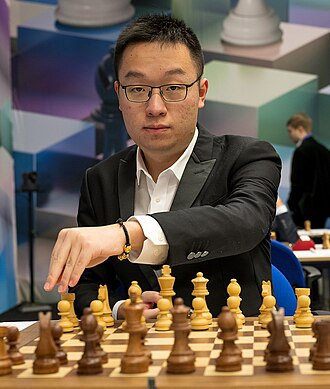

+++
date = '2026-09-29T16:30:00+02:00'
title = 'Game of The Olympiad! || Abdimalik Abdisalimov vs Wei Yi'
weight = 9223372036641924007
+++

<!--
.image wei.jpg
-->

[Wei Yi](https://nl.wikipedia.org/wiki/Wei_Yi) is een speler die **altijd** de aanval zoekt.

Terwijl de meeste spelers in de laatste ronde van de de Olympiade te Uzbekistan het al lang welletjes vonden, ontbont Wei Yi zijn duivels:

<!--
.yt LFyoROLP_pU
-->


Je kan de video ook bekijken op [dropbox](https://www.dropbox.com/scl/fi/bmfcc6bx398cg7mhiwds7/Game_of_The_Olympiad_Abdimalik_Abdisalimov_vs_We.mp4?rlkey=e1ecg0xujylbrssaw32pf6x5d&dl=0)
<!--
.game game.pgn
-->

<!-- Game begin -->
<link href="/okra/js/lichess/pgn/lichess-pgn-viewer.css" type="text/css" rel="stylesheet" />

&#160;

<!-- Game end -->
