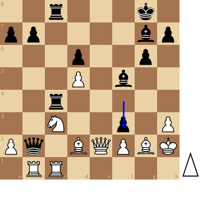

+++
date = '2026-08-29T16:42:06+02:00'
title = 'De legendarische zesde partij (3)'
weight = 9223372036644601681
+++

<!--
.image image.jpg
-->

De zesde partij van het Wereldkampioenschap schaken in 1960 tussen [Mikhail Botvinnik](https://nl.wikipedia.org/wiki/Michail_Botvinnik) (wit) en [Mikhail Tal](https://nl.wikipedia.org/wiki/Michail_Tal) (zwart) is een van de beroemdste en meest legendarische schaakpartijen uit de geschiedenis. Tal speelde met zwart en bracht een iconisch, vroeg stukoffer in de Koningsindische Verdediging.

**Het Belang en het Verloop van de Partij**

**De Strijd**: Botvinnik was de methodieke, logische wereldkampioen. Tal stond bekend om zijn wilde, intuitieve combinaties en offers.

**Het Offer**: Al in de opening gaf Tal met zwart een paard offer om de witte stelling open te breken en de initiatief te grijpen.

**Het Resultaat**: Het offer bracht Botvinnik volledig van de wijs. Tal won de partij overtuigend (0-1) en nam daarmee de leiding in de tweekamp, die hij uiteindelijk zou winnen om de 8ste wereldkampioen te worden.

<!--
.diagram fen:2r3k1/pp4bp/3p2p1/3P1b2/2r5/2N2p1P/Pq1BQPBK/1RR5 w - - 0 25; arrow:f4f3
-->

Dit is de echte Tal aan het werk: hij offert zijn dame!

<!--
.yt mzvAR2N39P8
-->


Je kan de video ook bekijken op [dropbox](https://www.dropbox.com/scl/fi/wvwx3fgwbd1749owgjeu0/Storm_of_the_Century_Tal_vs_Botvinnik_1960_Game_.mp4?rlkey=1hmrswuo41bm9dhkgwps4iucj&dl=0)

<!--
.game game.pgn
-->

<!-- Game begin -->
<link href="/okra/js/lichess/pgn/lichess-pgn-viewer.css" type="text/css" rel="stylesheet" />

&#160;

<!-- Game end -->

