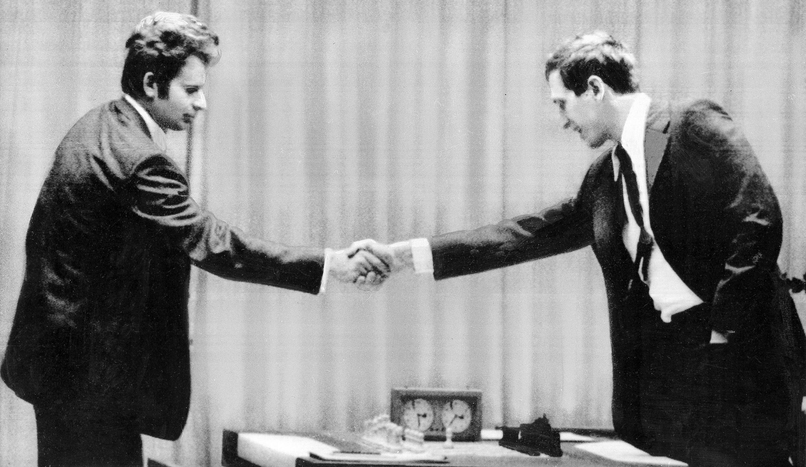
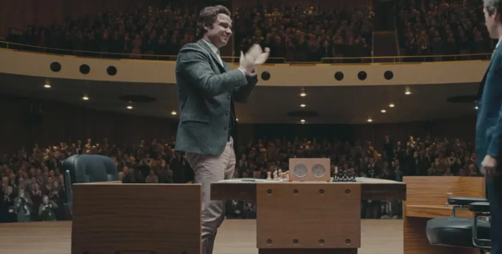

+++
date = '2026-08-23T15:09:29+02:00'
title = 'De legendarische zesde partij (1)'
+++
<!--
.image sf.jpg
-->

De zesde partij in de legendarische match tussen Spassky en Fischer tijdens het [weledkampioenschap schaken van 1972](https://en.wikipedia.org/wiki/World_Chess_Championship_1972)
werd legendarisch. Het was niet alleen een prachtige partij maar het was ook een voorbeeld van sportiviteit: toen Fischer won en het publiek applaudisseerde, begon ook Spasski te applaudisseren.

Uit [chess.com](https://www.chess.com/article/view/50-year-anniversary-fischer-spassky-game-6)

<i>
"""
The sixth game, described by GM Bobby Fischer as his best game in the match, was likely the major turning point of the 1972 World Chess Championship. The challenger, who started the match trailing by two points, began to take control. Losing the first game and then forfeiting the second, Fischer returned to win game three, draw game four, and win game five to tie the score. After winning the unforgettable game featured in this article, the American grandmaster took the lead for the first time in the match.

Fischer was on the precipice of a sensational and unbelievable comeback. Both of his wins came with the black pieces—a rarity in a world championship match. Spassky's play had begun to show signs of weakness, angst, and a decline in the confidence he exuded in the early rounds. With the score now level, the match had begun anew in a sense—but Fischer was on the upswing, having just won game five. With the white pieces in game six, a victory would come at a critical moment psychologically. The rest, as they say, is history.

A New Opening
Fischer, who had almost exclusively played 1.e4 during his career, famously said that this first move is "best by test." His approximately 750 tournament games by the 1972 match had confirmed his perspective, so when he opened this game with the English Opening (1.c4), it shocked both the roughly 1,600-person audience in Laugardalsholl, where they played, and the world watching. Note that original footage of this game would not be captured as they played without cameras in the main playing hall. 
"""
</i>

In deze [tekst](fischer-spassky-6th-match-game-world-championship-reykjavik-1972-1.pdf) kan je de commentaar van [Michael Tal ](https://nl.wikipedia.org/wiki/Michail_Tal) lezen

<!--
.image applause.jpg
-->

<!--
.yt dv52uwNfFZg
-->


Je kan de video ook bekijken op [dropbox](https://www.dropbox.com/scl/fi/df5k8gknzj8yn8o4hyrj8/The_Applause_Fischer_vs_Spassky_1972_Game_6_dv52.mp4?rlkey=bsexckh7f962sr0nxifvzana4&dl=0)
<!--
.game game.pgn
-->

<!-- Game begin -->
<link href="/okra/js/lichess/pgn/lichess-pgn-viewer.css" type="text/css" rel="stylesheet" />

&#160;

<!-- Game end -->

