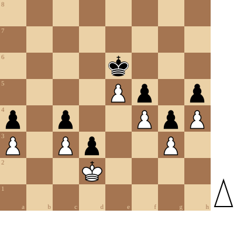

+++
date = 2026-05-19T11:51:16+02:00
title = "OKRA Eke tegen een sterke tegenstander"
weight = 9223372036653431931
+++

<!--
.diagram 8/8/4k3/4Pp1p/p1p2PpP/P1Pp2P1/3K4/8 w - - 10 49
-->

De eindstelling is een mooi voorbeeld van de kracht van het vierkant: Wit kan het vierkant van pion d3 niet verlaten en Zwart is gebonden aan pion e5.

Met de Okra groep tegen een sterke regenstander in een 10 minuten partij (+10 seconden per zet).

Dit is echt een moeilijke opdracht: er is weinig tijd om te discussieren.

De partij werd een eervolle remise.

<!--
.game game.pgn
-->

<!-- Game begin -->
<link href="/okra/js/lichess/pgn/lichess-pgn-viewer.css" type="text/css" rel="stylesheet" />

&#160;

<!-- Game end -->

