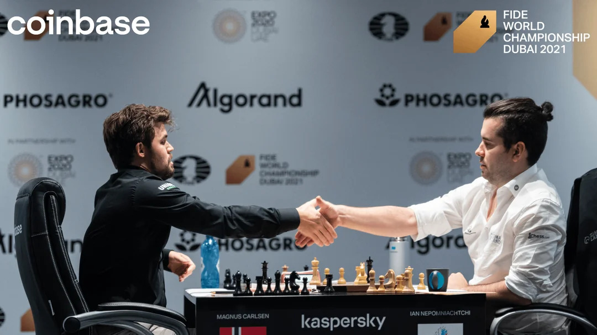
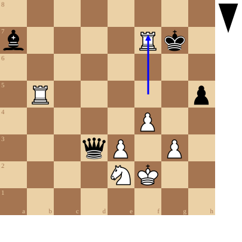

+++
date = 2026-08-29T16:13:16+02:00
title = "De legendarische zesde partij (2)"
weight = 9223372036644603411
+++

<!--
.image image.jpg
-->

De 6e partij tussen Fischer en Spasski was legendarisch.

Maar wat te denken van de [6e partij tussen Carlsen en Nepomniachtchi](https://en.wikipedia.org/wiki/Carlsen_versus_Nepomniachtchi,_World_Chess_Championship_2021,_Game_6) ?

Deze partij van 136 zetten was ook de langste in tijd: het name zo maar eventjes 7 uur en 45 minuten (de partij eindigde na middernacht) vooraleer de regerende wereldkampioen won van zijn Russische uitdager.

In de daarop volgende partijen stortte de uitdager volledig in en verloor uiteindelijk de match met 7½–3½

<!--
.diagram fen:8/b4Rk1/8/1R5p/5P2/3qP1P1/4NK2/8 b - - 0 80; arrow:f5f7
-->

Magnus offert zijn toren regen een pion en een loper en wint op magistrale wijze dit eindspel.

<!--
.yt A8XpSCL2f_Y
-->


Je kan de video ook bekijken op [dropbox](https://www.dropbox.com/scl/fi/qfxwfwv6ee78lonyslft3/Magnus_Carlsen_vs_Ian_Nepomniachtchi_World_Chess.mp4?rlkey=1k4ybz5uhjb4bieis825n0egp&dl=0)
<!--
.game game.pgn
-->

<!-- Game begin -->
<link href="/okra/js/lichess/pgn/lichess-pgn-viewer.css" type="text/css" rel="stylesheet" />

&#160;

<!-- Game end -->

