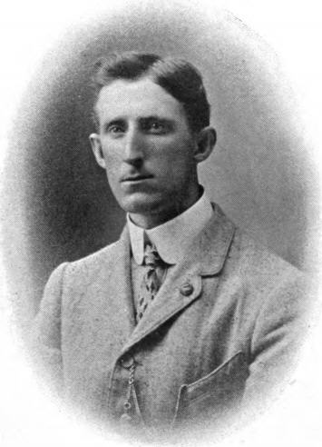
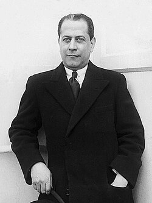

+++
date = '2026-07-29T22:30:44+02:00'
title = 'Marshall Attack'
+++

<!--
.image fm.jpg
-->

Marshall, geboren in New York, woonde vanaf zijn achtste in het Canadese Montréal, waar hij het schaken leerde toen hij ongeveer tien jaar oud was. Hij was een sterke aanvalsspeler en genoot bekendheid als gambietspeler en op toernooien had hij veel succes, al bleken Capablanca en Siegbert Tarrasch te sterk voor hem.

<!--
.image rc.jpg
-->

José Raúl Capablanca (Havana, 19 november 1888 – New York, 8 maart 1942) was een Cubaanse schaker, wereldkampioen van 1921 tot 1927.
Hij was een wonderkind. Reeds in 1909 versloeg hij de Amerikaan Frank Marshall in een match te New York.

In 1909 speelde hij simultaan tegen 720 schakers. Hij won 686 partijen (95%), hij verloor 14 partijen (2%) en speelde 20 remises (3%). In het beroemde toernooi in Sint-Petersburg in 1914 werd Capablanca tweede achter Emanuel Lasker. Hij versloeg Siegbert Tarrasch, Aleksandr Aljechin en Frank Marshall. In 1918 speelde Frank Marshall zijn befaamde Marshallgambiet tegen Capablanca. Capablanca won.

<!--
.yt https://www.youtube.com/watch?v=v7hc715hvVg
-->


Je kan de video ook bekijken op [dropbox](https://www.youtube.com/watch?v=v7hc715hvVg)
<!--
.game game.pgn
-->

<!-- Game begin -->
<link href="/okra/js/lichess/pgn/lichess-pgn-viewer.css" type="text/css" rel="stylesheet" />

&#160;

<!-- Game end -->

