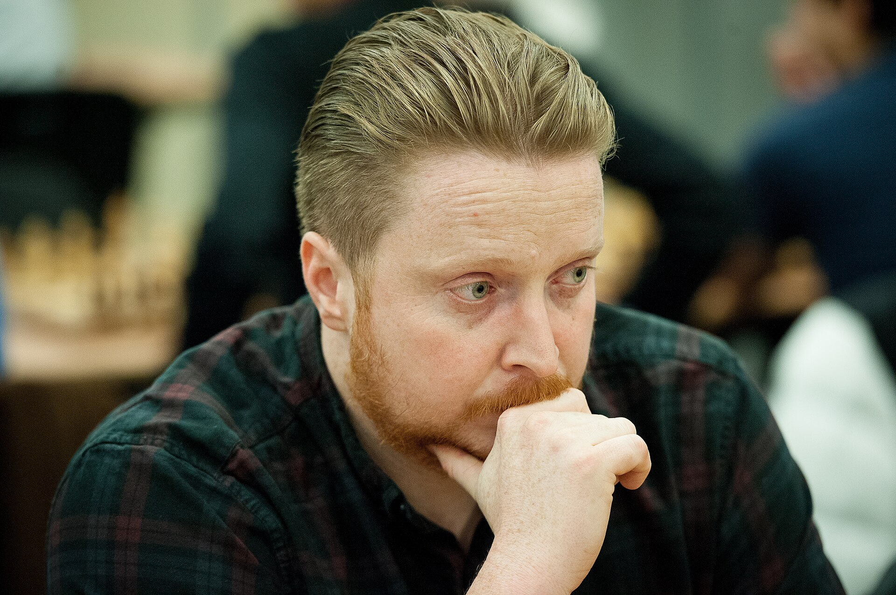

+++
date = '2026-09-02T11:02:14+02:00'
title = 'Titled Tuesday: Simon Williams vs GothamChess'
weight = 9223372036644276473
+++
Een duel tussen twee bekende Internet streamers.

<!--
.image sw.jpg
-->

[Simon Williams](https://nl.wikipedia.org/wiki/Simon_Williams) is mijn absoluut favoriete chess-streamer: zijn kleurrijke verschijning aangevuld met zijn bizarre openingskeuze zorgen steeds voor spektakel.
Vergis u niet: hij is wel degelijk een zeer sterke schaker.

<!--
.image gc.jpg
-->

[Levy Rozman](https://nl.wikipedia.org/wiki/Levy_Rozman), beter gekend als Gotham Chess, is een Internationaal meester en misschien wel de best verdienende schaker ooit: met meer dan 7 miljoen abonnees op zijn YouTube kanaal zit hij gebeiteld!

In deze partij spelen beiden tegen elkaar.

<!--
.yt q_Jup2SvghI
-->


Je kan de video ook bekijken op [dropbox](https://www.dropbox.com/scl/fi/kfzopzvtdz2ouxdyn7utx/BRILLIANT_MOVE_Simon_Williams_vs_GothamChess_q_J.mp4?rlkey=wae49u5s8hjfxd9w351jn3eko&dl=0)

