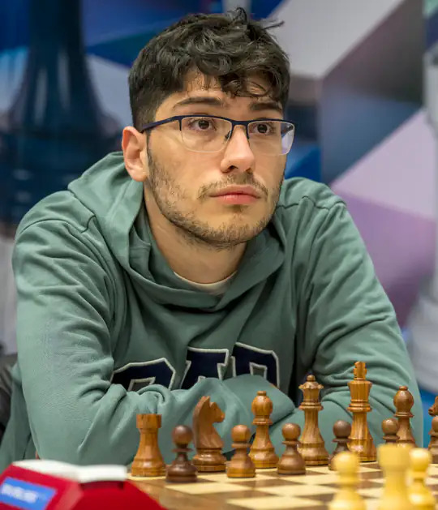
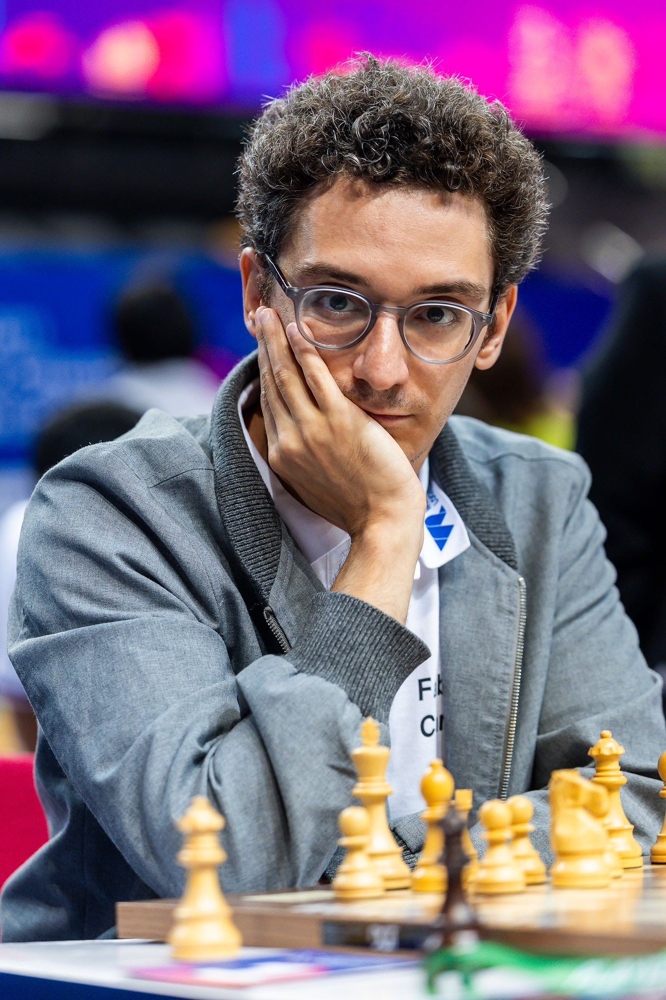

+++
date = 2026-08-11T16:49:59+02:00
title = "Laten we twee torens offeren ..."
weight = 9223372036646156408
+++

Korte partijen zijn zeldzaam. Zeker tussen 2 topgrootmeesters.

<!--
.image af.jpg
-->

[Alireza Firouzja](https://nl.wikipedia.org/wiki/Alireza_Firouzja) is een top 10 grootmeester uit Iran.

<!--
.image caruana.jpg
-->

Hij name het op tegen [Fabiano Caruana](https://nl.wikipedia.org/wiki/Fabiano_Caruana) en kijk eens wat hem overkwam!

<!--
.yt https://www.youtube.com/watch?v=sMBCK9sy9Rs&list=PLlN1WdzKJmlLS17Yu35d7HPJqvpL9VKwM
-->


Je kan de video ook bekijken op [dropbox](https://www.dropbox.com/scl/fi/vaqb8e7meizopg77fkeoc/FABIANO_SACRIFICES_2_ROOKS_AND_WINS_IN_9_MOVES_s.mp4?rlkey=5fcks8sljd46ql9etd3djfad3&dl=0)
<!--
.game game.pgn
-->

<!-- Game begin -->
<link href="/okra/js/lichess/pgn/lichess-pgn-viewer.css" type="text/css" rel="stylesheet" />

&#160;

<!-- Game end -->

