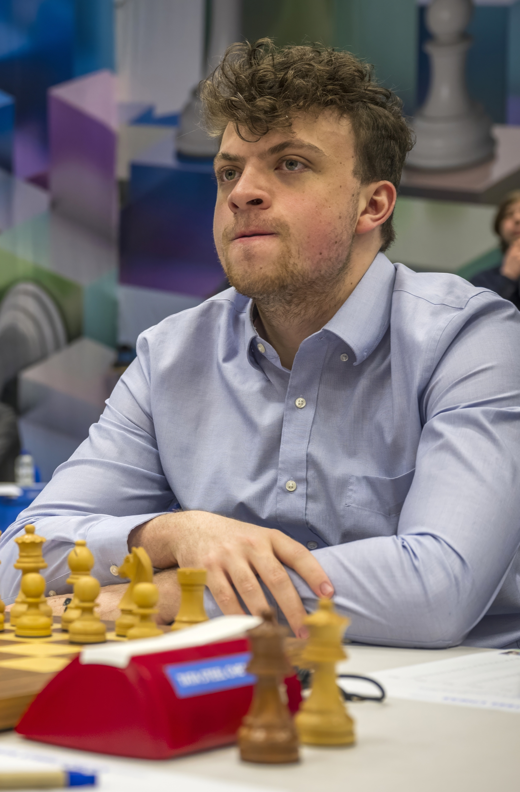
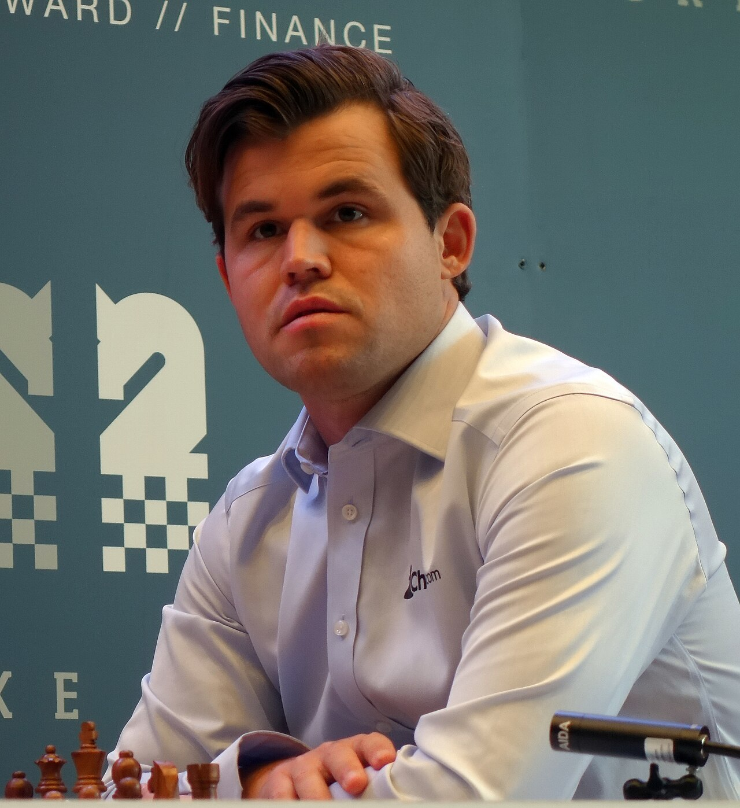

+++
date = '2026-08-13T10:35:31+02:00'
title = 'Niet de beste vrienden'
+++

Hans Niemann
<!--
.image hans.jpg
-->

Magnus Carlsen
<!--
.image magnus.jpg
-->

[Hans Niemann](https://nl.wikipedia.org/wiki/Hans_Niemann) en [Magnus Carlsen](https://nl.wikipedia.org/wiki/Magnus_Carlsen) zijn niet bepaald vrienden.

Het online schaakplatform Chess.com schorste Niemann tijdelijk tweemaal wegens vals spel, omdat hij zich door een computer zou hebben laten bijstaan. De eerste keer was toen hij 12 jaar oud was. De tweede keer was hij zestien jaar en net uit huis. Hij wilde van zijn Youtube-streams kunnen leven en meende daarvoor een groter publiek te kunnen trekken als hij tegen sterkere schakers zou spelen. Om dit te bewerkstelligen moest zijn rating opgekrikt worden en dat deed hij door in een aantal partijen vals te spelen. In een interview in september 2022 zei hij over die tweede keer: "Dat was mijn grootste vergissing en ik schaam mij ervoor".

Sinds de problematische winst van Niemann tegen Carlsen in de Sinquefield Cup zijn het aartsvijanden.

Op 12 augustus 2026 kwamen ze elkaar tegen in de Esports World Cup 2026 in de halve finales.

Hier is hun partij:

<!--
.yt 9jGGGaZYc6A
-->


Je kan de video ook bekijken op [dropbox](https://www.dropbox.com/scl/fi/qdztyrf9rsf250w5efrfc/The_Chess_Game_Of_The_Year_Finally_Happened_Carl.mp4?rlkey=gf4budv5lepy1u5zjtgplb5pl&dl=0)
<!--
.game game.pgn
-->

<!-- Game begin -->
<link href="/okra/js/lichess/pgn/lichess-pgn-viewer.css" type="text/css" rel="stylesheet" />

&#160;

<!-- Game end -->

