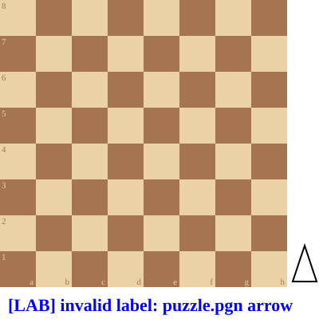

+++
date = 2026-07-29T18:49:01+02:00
title = "Bodhana Sivanandan"
weight = 9223372036647272466
+++

<!--
In .link articles/polgar/index.md
-->
In [Judit Polgar]() (artikel)
maakten we kennis met Judit Polgar

Judit was jarenlang de jongste schaakster die ooit een grootmeester met meer dan 2600 ELO versloeg.

Dit record werd nu afgneomen door het Engels schoolmeisje Bodhana Silvanadan: zij won van de Franse kampioen Maurizzi (2628 ELO).

Uit de Guardian:
*"""England’s 11-year-old talent Bodhana Sivanandan scored her best individual result last Saturday, when the Harrow schoolgirl defeated France’s 2628-rated grandmaster Marc’Andria Maurizzi, 19, in the opening round of the Dole Trophy in Aix-en-Provence. Maurizzi was world under-20 junior champion in 2023 and is the current French champion."""*

Ze deed dit met een mooie combinatie na een niet-evidente blunder van Maurizzi.

<!--
.diagram puzzle.pgn arrow:b6b4
-->

<!--
.puzzle puzzle.pgn
-->

(Je kan de partij <a href="puzzle.pgn">hier</a> downloaden in PGN formaat)

&#160;

