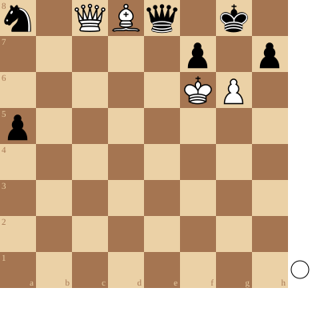

+++
date = 2026-04-09T13:40:52+02:00
title = "De puzzel waarvoor het woordje \"amazing\" is uitgevonden\""
weight = 9223372036656881355
+++

<!--
.diagram game.pgn
-->

Wit speelt en wint!

<!--
.tube https://www.youtube.com/watch?v=MP2-0tV4BIM
-->


<!--
.dropbox https://www.dropbox.com/scl/fi/6o8p8tc4bxvgoxu2letgn/AMAZING-Chess-Puzzle-From-Reddit.mp4?rlkey=ylzofhcyrn1uakh6l8497uqoj&st=j6sz1qzz&dl=0
-->
Je kan de video ook bekijken op [dropbox](https://www.dropbox.com/scl/fi/6o8p8tc4bxvgoxu2letgn/AMAZING-Chess-Puzzle-From-Reddit.mp4?rlkey=ylzofhcyrn1uakh6l8497uqoj&st=j6sz1qzz&dl=0)

<!--
.puzzle game.pgn
-->

&#160;

