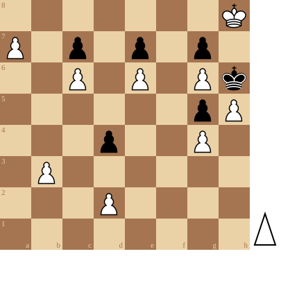

+++
date = 2026-06-27T10:43:14+02:00
title = "Prachtige eindspel"
weight = 9223372036650066413
+++

Als we een pion promoveren nemen we automatisch een koningin: het sterkste stuk op het bord staat garant voor de winst.

Toch zagen we in 
[Underpromotion]() (artikel)
tot drie maal toe, dat wit alleen wint door te promoveren tot een ander stuk.

<!--
.diagram puzzle.pgn
-->

Deze schaakpuzzel gaat over hetzelfde thema!



Je kan de video ook bekijken op [dropbox](https://www.youtube.com/watch?v=irbZZcWty-M)

(Je kan de partij <a href="puzzle.pgn">hier</a> downloaden in PGN formaat)

&#160;

