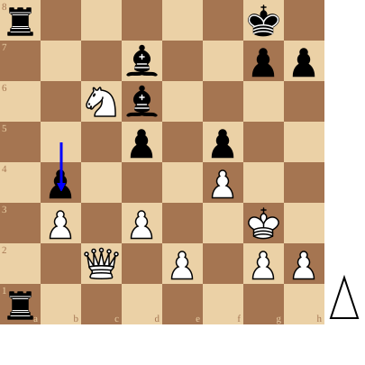
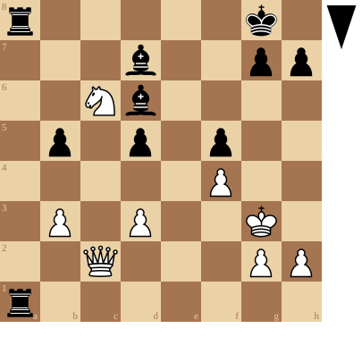
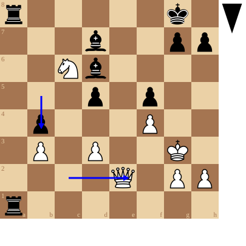

+++
date = '2026-10-03T17:05:38+02:00'
title = 'Diep kijken in een stelling'
weight = 9223372036641576269
+++

<!--
.diagram fen:r5k1/3b2pp/2Nb4/1p1p1p2/5P2/1P1P2K1/2Q1P1PP/r7 b - - 0 1
-->

De sleutel tot het winnen van partijen tegen een gelijkwaardige tegenstander ligt hem in het **diep** kijken in de stelling: het vinden van kleine dingen die het verschil maken.

De partij tegen Francis kampte heel erg. Totdat hij in tijdnood een fout maakte en twee torens moest geven tegen de Dame. Toch is het pleit verre van beslecht.

Zwart kan echter een diepe zet spelen die hem groot voordeel oplevert.

<!--
.diagram fen:r5k1/3b2pp/2Nb4/3p1p2/1p3P2/1P1P2K1/2Q1P1PP/r7 w - - 0 2; arrow:b5b4
-->

Nauwkeurigheid is cruciaal.

Bekijk even de volgende stelling:

<!--
.diagram fen:r5k1/3b2pp/2Nb4/1p1p1p2/5P2/1P1P2K1/2Q3PP/r7 b - - 0 1
-->

Na b5-b4 heeft With het antwoord: De2

<!--
.diagram fen:r5k1/3b2pp/2Nb4/3p1p2/1p3P2/1P1P2K1/4Q1PP/r7 b - - 1 2; arrow:b5b4,c2e2
-->

