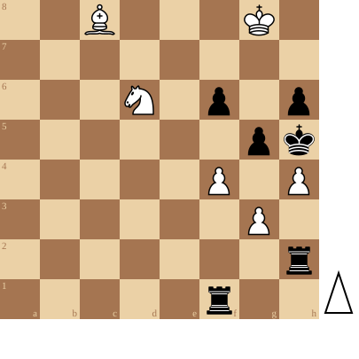

+++
date = '2026-08-23T16:33:03+02:00'
title = 'Genrikh Kasparyan'
+++

Uit [Wikipedia](https://en.wikipedia.org/wiki/Genrikh_Kasparyan):

<i>
"""
Genrikh Kasparyan (Surname also spelled Kasparian) (27 February 1910 – 27 December 1995) was an Armenian chess player. He is considered to have been one of the greatest composers of chess endgame studies.
"""
</i>

<!--
.diagram puzzle.pgn
-->

<!--
.yt 2dkesRnWS58
-->
       
       
Je kan de video ook bekijken op [dropbox](https://www.dropbox.com/scl/fi/bug26u43dw8im6poo8ef2/This_is_Brilliant_Genrikh_Kasparyan_chess_endgam.mp4?rlkey=h0af94fndcdac9h5357wme43q&dl=0)
<!--
.puzzle puzzle.pgn
-->

(Je kan de partij <a href="puzzle.pgn">hier</a> downloaden in PGN formaat)

&#160;

